# 경제지표 분석 (물가, 유가 등)

---

### https://ecos.bok.or.kr/#/StatisticsByTheme/KoreanStat100

# 한국은행 ECOS 100대 지표 쉽게 이해하기

한국은행 경제통계시스템(ECOS)의 **100대 지표**는 한국 경제를 파악하는 데 가장 중요한 핵심 지표들입니다.  
경제 뉴스와 금융 시장에서 자주 등장하는 지표를 중심으로 쉽게 정리하였습니다.

## 1. 금융 분야 주요 지표 (자산운용에서 특히 중요)

- **기준금리 (정책금리)**  
  한국은행이 결정하는 가장 중요한 금리. 모든 시장금리의 기준이 됩니다. 기준금리가 오르면 대출이 줄고 경기가 위축되며, 내리면 반대 효과가 나타납니다.

- **시장금리**  
  - 단기: CD금리, 콜금리 등  
  - 장기: 국고채 3년·5년·10년물 수익률  
  국고채 수익률은 회사채·대출금리의 기준으로 사용되며, 금리가 상승하면 채권 가격은 하락합니다.

---
콜금리(Call Rate)는 금융기관끼리 아주 짧은 기간(보통 하루) 동안 돈을 빌려주고 받을 때 적용하는 이자율입니다.

급하게 돈이 필요할 때 전화로 "콜(Call)!" 해서 즉시 빌리고 다음 날 바로 갚는 초단기 금융거래에서 유래한 이름입니다.

## 핵심 특징 3가지

* **초단기 자금 조달:** 거래 기간이 대부분 1일물(오늘 빌려서 내일 갚는 구조)입니다.
* **금융기관 전용:** 은행, 증권사, 보험사 등 금융회사들끼리만 거래하며, 일반 개인은 이용할 수 없습니다.
* **일일 자금 수급 조절:** 고객의 예금 출금이나 대출 등으로 발생한 은행의 일시적인 자금 부족/남음 현상을 해결하는 구원투수 역할을 합니다.

## 기준금리와의 관계

한국은행이 **기준금리**를 결정하면 시장에서 가장 먼저 반응하는 금리가 바로 콜금리입니다. 한국은행은 채권 매매 등을 통해 시중 자금량을 조절함으로써 콜금리가 기준금리 수준에서 크게 벗어나지 않도록 관리합니다.

따라서 콜금리는 시중 자금 사정이 넉넉한지 팍팍한지를 가장 빠르게 보여주는 '금융시장의 체온계'라고 볼 수 있습니다.

---

CD금리(양도성예금증서 금리)는 은행이 발행하는 무기명 예금 증서인 CD(Certificate of Deposit)가 금융시장에서 거래될 때 적용되는 이자율입니다.

앞서 본 콜금리가 '하루짜리 초단기 금리'라면, CD금리는 보통 '3개월(91일)짜리 단기 금리'입니다.

## 핵심 특징 3가지

* **양도 가능한 예금:** 일반 예금과 달리 제3자에게 자유롭게 사고팔 수(양도) 있는 정기예금 증서입니다.
* **은행의 자금 조달 수단:** 은행이 시중에서 대규모 자금을 수개월 단위로 모을 때 발행합니다.
* **시중 대출금리의 기준:** 주택담보대출, 신용대출 등 다양한 대출 상품의 기준금리(지표금리)로 널리 쓰입니다.

## 콜금리 vs CD금리 한눈에 비교

| 구분 | 콜금리 | CD금리 |
| --- | --- | --- |
| **만기(기간)** | 1일 (초단기) | 주로 91일 (3개월 단기) |
| **주요 역할** | 은행 간 일시적 자금 조절 | 은행의 대규모 자금 조달 & 대출 기준 |
| **시장 성격** | 초단기 자금 시장의 체온계 | 시중 단기 금융시장의 대표 지표 |

## 나와의 연관성: 대출금리에 직접적 영향

은행에서 "CD금리 + 연 2%" 형태의 변동금리 대출을 받았다면, **CD금리가 오를 때 내 대출 이자 부담도 즉시 올라갑니다.** 과거에는 주택담보대출의 절대적인 기준이었으나, 최근에는 코픽스(COFIX)나 금융채 금리 등으로 다양화되었습니다. 그럼에도 여전히 수많은 대출 상품의 이자를 결정하는 중요 지표입니다.

---


- **예금금리 / 대출금리**  
  은행에서 실제 적용되는 예금 이자율과 대출 이자율. 가계와 기업의 자금 조달 비용을 직접적으로 보여줍니다.

- **가계신용·가계대출 및 연체율**  
  가계가 은행에서 빌린 총 금액과, 대출을 제때 갚지 못하는 비율. 연체율 상승은 금융 위험 신호로 해석됩니다.

- **M1·M2 통화 증가율**  
  - M1: 현금 + 요구불예금 (가장 유동성 높은 돈)  
  - M2: M1 + 정기예금 등 (경제 전체에 풀린 돈의 양)  
  M2 증가율이 높으면 물가 상승 압력, 낮으면 경기 둔화 가능성이 있습니다.

---
**M1과 M2는 시장에 돈(통화)이 얼마나 많이 돌아다니고 있는지를 측정하는 지표**입니다.

돈이라고 해서 우리가 주머니에 차고 다니는 현금만 뜻하는 게 아닙니다. "얼마나 빠르게 진짜 현금으로 바꿔서 쓸 수 있느냐(유동성)"에 따라 통화의 범위를 M1, M2로 구분합니다.

---

## 1. M1 (협의통화: "지금 당장 쓸 수 있는 돈")

M1(M1 Money Supply)은 **언제든지 즉시 현금화해서 물건을 살 수 있는 돈**을 뜻합니다.

* **포함되는 돈:**
* **지폐와 동전** (진짜 현금)
* **보통예금, 당좌예금** (은행에 들어있지만 체크카드로 결제하거나 ATM에서 바로 뽑을 수 있는 돈)
* **수시입출식 예금** (언제든 찾아 쓸 수 있는 예금)


* **특징:** 지불 능력이 가장 높습니다. 오늘 당장 마트나 가게에서 사용할 수 있는 돈들의 합계입니다.

---

## 2. M2 (광의통화: "약간의 시간만 지나면 바로 현금으로 바꿀 수 있는 돈")

M2(M2 Money Supply)는 **M1에 약간의 이자를 포기하거나 짧은 절차를 거치면 바로 현금으로 바꿀 수 있는 금융상품까지 합친 돈**입니다. 일반적인 의미의 '시중 통화량'을 말할 때는 보통 M2를 의미합니다.

* **포함되는 돈:**
* **M1 전체**
* **만기 2년 미만의 정기예금 및 정기적금**
* **만기 2년 미만의 MMF(머니마켓펀드), CD(양도성예금증서), RP(환매조건부채권)** 등


* **특징:** 약간의 손해(중도해지 수수료 등)를 감수하면 곧바로 현금화할 수 있는 돈까지 모두 포함합니다. (단, 만기가 2년 이상인 장기 예적금이나 채권 등은 약속 기간이 길어 즉시 쓰기 어렵기 때문에 M2에서 제외됩니다.)

---

## 한눈에 보는 비교 summary

| 구분 | M1 (협의통화) | M2 (광의통화) |
| --- | --- | --- |
| **별칭** | 단기 자금, 즉시 쓸 수 있는 돈 | 시중 유동성 (일반적인 통화량) |
| **구성** | 현금 + 수시입출식 예금 | **M1** + 2년 미만 정기예적금, MMF, CD 등 |
| **유동성(현금화 속도)** | 매우 높음 (즉시 가능) | 높음 (약간의 절차 필요) |

---

## 왜 M1, M2를 살펴볼까요?

1. **인플레이션(물가) 예측:** 시중에 M1이나 M2가 급격히 늘어나면 돈의 가치가 떨어지고 물가가 오를 가능성이 커집니다.
2. **경기 및 투자 흐름 파악:**
* **M1 비율이 높아질 때:** 사람들이 돈을 장기 예금에 묶어두지 않고 언제든 뺄 수 있게 놔둔다는 뜻입니다. 주식, 부동산 등 투자처를 찾고 있거나 경기 변동에 대비하려는 심리가 반영됩니다.
* **M2만 늘고 M1이 줄어들 때:** 돈이 정기예금 등 은행에 묶여 시장으로 잘 흘러 나오지 않고 있음을 뜻합니다.

---
M1과 M2에서 'M'은 돈, 즉 통화(Money) 또는 통화량(Money Supply)을 의미하는 영단어의 첫 글자입니다.

뒤에 붙은 숫자 **1과 2는 단순한 분류 번호**로, 현금에 얼마나 가까운가(유동성)를 나타내는 '단계'를 뜻합니다.

---

## M1, M2라고 부르는 이유 3가지

### 1. 현금화 속도에 따른 단계 분류 (Hierarchy)

경제학에서는 돈을 현금화하기 얼마나 쉬운지에 따라 순서대로 번호를 붙였습니다.

* **M1 (Money 1단계):** 가장 1순위로 **즉시 손에 쥘 수 있는 돈** (현금 + 수시입출금 예금)
* **M2 (Money 2단계):** M1을 포함해 **약간만 시간을 들이면 현금이 되는 2순위 돈** (M1 + 2년 미만 정기예적금 등)
* **M3 (Money 3단계):** M2를 포함해 **더 덩치가 크고 장기간 묶인 3순위 돈** (2년 이상 장기 금융상품, 금융기관 유동성 등)

숫자가 커질수록(1 $\rightarrow$ 2 $\rightarrow$ 3) 포함하는 돈의 범위는 넓어지지만, **현금으로 바꾸는 데 걸리는 시간과 제약은 늘어납니다.**

### 2. 국제 표준 명칭 (글로벌 공통어)

미국 연방준비제도(Fed)나 한국은행, 유럽중앙은행(ECB) 등 **전 세계 중앙은행이 공통으로 사용하는 표준 용어**입니다.
나라마다 금융 상품의 이름은 조금씩 달라도 "M1", "M2"라고 부르면 전 세계 경제학자와 정책 입안자들이 똑같은 기준(1단계 통화, 2단계 통화)으로 이해할 수 있습니다.

### 3. 경제학적 관습

1950년대~1960년대 현대 통화이론이 발전하면서, 경제학자들이 통화량 지표를 직관적으로 구분하기 위해 **$M_1$, $M_2$, $M_3$** 같은 기호를 기호화하여 논문에 쓰기 시작한 것이 그대로 정식 명칭으로 자리를 잡았습니다.

---

쉽게 생각해서 스마트폰 시리즈 이름인 **아이폰 1, 아이폰 2**처럼 "통화량 1번 범주", "통화량 2번 범주"라고 지정해 둔 기호라고 보시면 됩니다.

---


## 2. 물가 분야 주요 지표

- **소비자물가 상승률 (CPI)**  
  일반 국민이 실제로 느끼는 물가 상승률. 식료품, 주거, 교통 등 소비 바구니 가격 변동을 측정합니다. 한국은행의 물가 안정 목표(약 2%) 달성 여부를 판단하는 핵심 지표입니다.

- **생산자물가 상승률**  
  기업 간 거래 가격 변동률. 원자재 가격 변화가 먼저 반영되어 향후 소비자물가에 선행하는 경향이 있습니다.

### "물건을 만드는 공장에서 정하는 가격(생산자물가지수, PPI)이 오르면, 나중에 우리가 가게에서 사는 가격(소비자물가지수, CPI)도 따라서 오른다"는 뜻이에요!

이해하기 쉽게 '붕어빵 가게' 이야기로 설명해 줄게요.

---

## 1. CPI와 PPI가 뭘까요?

* **CPI (소비자물가지수):** 우리가 마트나 문구점에서 **물건을 살 때 내는 가격**이에요. (예: 붕어빵 사 먹는 가격)
* **생산자물가지수 (PPI):** 이 문장에서 말하는 가격이에요. 물건을 만들어 파는 **공장이나 가게 주인이 재료를 살 때 내는 가격**이에요. (예: 붕어빵 사장님이 사 오는 팥과 밀가루 가격)

---

## 2. 왜 "미래 물가를 미리 알 수 있다(선행성)"고 할까요?

붕어빵 가게 사장님의 상황을 생각해 봐요.

1. **재료값이 먼저 올라요:** 팥과 밀가루를 파는 공장에서 가격을 올렸어요. (생산자물가 상승)
2. **시간이 조금 지나요:** 사장님이 "에구, 재료값이 올라서 어쩔 수 없네" 하고 고민해요.
3. **손님에게 파는 가격을 올려요:** 결국 며칠 뒤 붕어빵 가격을 1,000원에서 1,500원으로 올려서 팔아요. (소비자물가 상승)

이처럼 **공장 가격(생산자물가)이 먼저 오르고, 조금 뒤에 마트 가격(소비자물가)이 따라 오릅니다.**

그래서 공장 가격이 오르는 것을 미리 보면, *"아! 조금 있으면 우리가 마트에서 사는 물건값도 오르겠구나!"* 하고 **미래의 물가를 미리 예측**할 수 있는 거랍니다!

---

- **근원물가 상승률**  
  식료품과 에너지 가격을 제외한 기조적 물가. 일시적 충격을 제외하고 본질적인 물가 흐름을 파악할 때 사용합니다.

## 3. 실물 경제·경기 관련 주요 지표

- **경제성장률 (GDP 성장률)**  
  우리나라 경제가 얼마나 성장했는지를 보여주는 가장 종합적인 지표. 분기별·연간으로 발표됩니다.

- **민간소비 증가율**  
  가계의 소비 동향. 내수 경기의 핵심 동력입니다.

- **설비투자 증가율**  
  기업이 기계·설비에 투자하는 규모. 미래 성장 잠재력을 보여주는 지표입니다.

- **건설투자 증가율**  
  건물·인프라 건설 투자 동향. 부동산 시장과 밀접한 관련이 있습니다.

- **경상수지**  
  상품·서비스 수출입, 해외 투자 수익 등을 합한 국제수지. 지속적인 흑자는 원화 가치 상승 요인이 됩니다.

- **환율 (원/달러)**  
  1달러를 사는 데 필요한 원화 금액. 수출 기업에는 낮은 환율이, 해외 여행·수입에는 높은 환율이 유리합니다.

## 4. 고용·임금 관련 주요 지표

- **실업률**  
  일할 의사가 있는 사람 중 실제로 일하지 못하는 비율.

- **고용률**  
  15세 이상 인구 중 실제로 일하고 있는 사람의 비율.

- **시간당 명목임금**  
  노동자들이 시간당 받는 평균 임금 수준.

## 활용 팁 (취업 준비 시)

- **자산운용·리서치 직무**에서는 **기준금리, 국고채 수익률, M2, 가계대출, CPI**를 가장 주의 깊게 살펴보세요.  
- ECOS 페이지에서 각 지표를 클릭하면 최신 수치, 그래프, 과거 추이를 바로 확인할 수 있습니다.

---

> 📺 **YouTube 강의**: [🎬 경제지표 분석 물가 유가 환율](https://www.youtube.com/results?search_query=경제지표+분석+물가+유가+환율+한국어+투자)
>


## 오늘 배울 것


- 소비자물가지수(CPI)와 생산자물가지수(PPI)
- 유가(WTI, 브렌트유) 분석
- 환율과 주가의 관계
- 실업률, GDP 성장률 지표 해석
- 실습: 주요 경제지표 데이터 수집 및 상관관계 분석

---

## 🔗 참고 사이트 & 데이터 원천


> 이 문서(경제지표 — 물가·유가·환율·실업률)의 실습에 필요한 공식 데이터 출처와 참고 사이트입니다. ⚿ 는 API 키 또는 승인이 필요한 항목입니다.

### 📊 국내 공식 데이터

| 기관 | URL | API 키 | 제공 데이터 |
|------|-----|--------|-------------|
| 통계청 KOSIS | <https://kosis.kr> | ⚿ 권장 | 국내 CPI, PPI, 고용통계, GDP |
| 한국은행 ECOS | <https://ecos.bok.or.kr> | ⚿ 필요 | 환율, 물가지수, 수출입물가 |
| 공공데이터포털 | <https://www.data.go.kr> | ⚿ 필요 | 유가, 원자재 공공 데이터 |
| 산업통상자원부 에너지 통계 | <https://www.motie.go.kr> | 불필요(웹 조회) | 국내 유가·에너지 소비 현황 |

---

### 📈 차트 & 뉴스 참고

| 분류 | 사이트 | URL | 활용 용도 |
|------|--------|-----|-----------|
| 차트 플랫폼 | TradingView | <https://www.tradingview.com> | 유가·환율·물가 관련 차트 |
| 차트 플랫폼 | Investing.com | <https://www.investing.com> | 경제 지표 캘린더·실시간 시세 |
| 금융 포탈 | 네이버 금융 | <https://finance.naver.com> | 국내 경제지표·환율 현황 |
| 금융 미디어 | 머니투데이 방송(MTN) | <https://mtn.co.kr> | 물가·유가·환율 뉴스 분석 |
| 금융 미디어 | 이데일리 | <https://www.edaily.co.kr> | 경제지표 발표 속보 |
| 금융 정책 | 금융위원회 | <https://www.fsc.go.kr> | 물가·금융안정 정책 정보 |
| 금융 감독 | 금융감독원(FSS) | <https://www.fss.or.kr> | 금융시장 안정 모니터링 |

---

### 1. 소비자물가지수(CPI)와 생산자물가지수(PPI)

> 📖 **Wikipedia**: [소비자 물가 지수](https://ko.wikipedia.org/wiki/소비자_물가_지수) · [생산자 물가 지수](https://ko.wikipedia.org/wiki/생산자_물가_지수) · [인플레이션](https://ko.wikipedia.org/wiki/인플레이션)

**CPI (Consumer Price Index, 소비자물가지수)**

소비자가 실제로 구매하는 상품·서비스 바구니의 가격 변화를 측정하는 지표입니다.

- 기준: 특정 연도를 100으로 설정해 상대적 변화를 나타냄
- 발표: 한국 통계청 (월 1회), 미국 BLS (월 1회)
- **핵심 근원물가(Core CPI)**: 에너지·식품을 제외한 CPI → 변동성이 낮아 추세 파악에 유리

**CPI 수치별 중앙은행 반응**

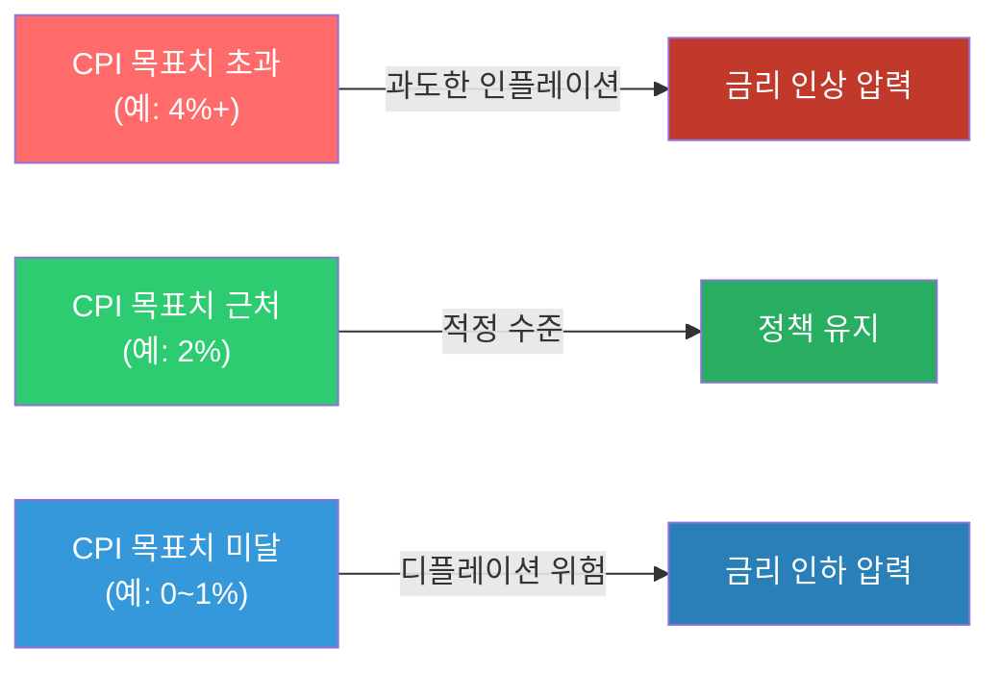

> 📺 [🎬 소비자물가지수 CPI 뜻 설명](https://www.youtube.com/results?search_query=소비자물가지수+CPI+인플레이션+한국어+설명)

**PPI (Producer Price Index, 생산자물가지수)**

기업이 생산·판매하는 상품의 가격 변화를 측정합니다. CPI보다 **선행성**이 있어 미래 물가를 예측하는 데 사용됩니다.

**PPI → CPI 파급 경로**


> 📺 [🎬 PPI 생산자물가지수 CPI 차이](https://www.youtube.com/results?search_query=PPI+생산자물가지수+CPI+차이+한국어)

```python
# CPI 변화율(인플레이션율) 계산 예시
cpi_monthly = [104.5, 105.2, 104.8, 106.3, 107.1, 108.0]

# 전월 대비 변화율 (MoM)
mom = [(cpi_monthly[i] - cpi_monthly[i-1]) / cpi_monthly[i-1] * 100
       for i in range(1, len(cpi_monthly))]

# 연율 환산 (MoM * 12)
annualized = [m * 12 for m in mom]

for i, (m, a) in enumerate(zip(mom, annualized)):
    print(f"{i+2}월: MoM {m:.2f}%  |  연율환산 {a:.1f}%")
```

#### 🔗 Python 소스 연계

이 섹션의 물가지표(CPI)는 웹앱의 **거시경제현황 1 (실시간)** 탭에서 직접 확인할 수 있습니다.

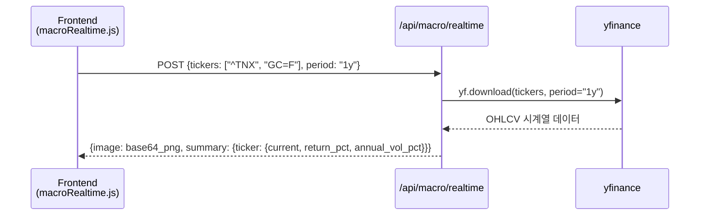

| API 파라미터 | 값 예시 | 설명 |
|---|---|---|
| `tickers` | `["^TNX"]` | 미국 10년물 국채금리 (금리 인상/인하 신호) |
| `period` | `"1y"`, `"6mo"`, `"3mo"` | 조회 기간 |

---

### 1-1. FOMC(연방공개시장위원회)란? — 왜 전 세계 자산시장이 주목하는가

> 📖 **Wikipedia**: [연방공개시장위원회](https://ko.wikipedia.org/wiki/연방공개시장위원회) · [연방준비제도](https://ko.wikipedia.org/wiki/연방준비제도) · [기준금리](https://ko.wikipedia.org/wiki/기준금리)

**FOMC(Federal Open Market Committee, 연방공개시장위원회)**는 미국 중앙은행(연준, Fed) 안에서 **기준금리(정책금리)를 결정하는 회의체**입니다. 한국은행 금융통화위원회가 한국의 기준금리를 정하듯, FOMC는 미국의 기준금리(연방기금금리, Federal Funds Rate)를 정합니다.

- **개최 주기**: 연 8회(약 6주 간격) 정례회의 + 필요 시 긴급회의
- **구성**: 연준 이사 7인 + 지역 연방준비은행 총재 5인(로테이션) = 총 12명 투표권
- **핵심 발표물**: 정책금리 결정문(Statement), 위원별 금리 전망(Dot Plot, 연 4회), 제롬 파월 의장 기자회견

**FOMC가 전 세계에 영향을 미치는 이유**

미국 달러는 기축통화이고, 미국 국채 금리는 전 세계 자산 가격의 '할인율' 기준점 역할을 합니다. 미국 기준금리가 바뀌면 전 세계 자금 흐름의 방향이 바뀝니다.

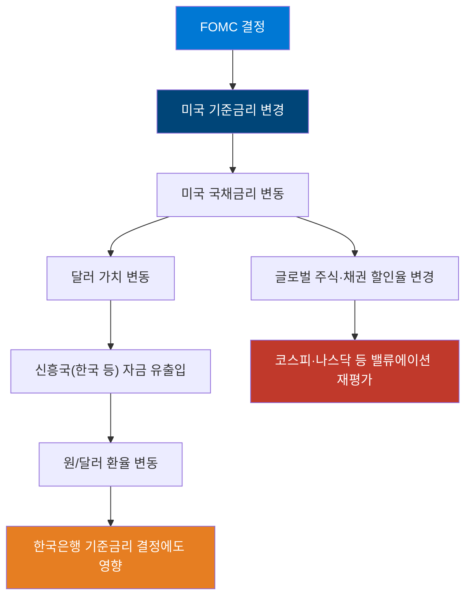

**FOMC 발표 시 시장이 보는 3가지 포인트**

| 포인트 | 설명 | 시장 반응 |
|---|---|---|
| **금리 결정 자체** | 동결/인상/인하 여부 | 예상과 다르면(서프라이즈) 변동성 급증 |
| **점도표(Dot Plot)** | 위원들이 예상하는 향후 금리 경로 | 시장 예상보다 매파적(hawkish)이면 위험자산 약세 |
| **파월 의장 기자회견 발언** | 향후 정책 방향에 대한 뉘앙스 | "추가 인상 배제 안 해" 등 문구 하나에도 급변동 |

**매파(Hawkish) vs 비둘기파(Dovish)**

| 구분 | 성향 | 정책 방향 | 자산시장 영향 |
|---|---|---|---|
| **매파(Hawkish)** | 물가 안정 우선 | 금리 인상/고금리 유지 선호 | 주식·코인 등 위험자산에 부정적, 달러 강세 |
| **비둘기파(Dovish)** | 경기 부양 우선 | 금리 인하/완화 선호 | 위험자산에 긍정적, 달러 약세 |

---


### 2. 유가(WTI, 브렌트유) 분석

> 📖 **Wikipedia**: [서부 텍사스 원유](https://ko.wikipedia.org/wiki/서부_텍사스_원유) · [브렌트유](https://ko.wikipedia.org/wiki/브렌트유) · [석유수출국기구](https://ko.wikipedia.org/wiki/석유수출국기구)

**WTI vs 브렌트유**

| 구분 | WTI (West Texas Intermediate) | 브렌트유 (Brent Crude) |
|------|-------------------------------|------------------------|
| 원산지 | 미국 텍사스 | 북해 |
| 기준 시장 | NYMEX (뉴욕) | ICE (런던) |
| 특징 | 미국 기준 원유, 경질유 | 글로벌 기준 원유 (세계 원유 70%+ 기준) |
| 가격 차이 | 보통 WTI가 $1~3 저렴 | — |

> 📺 [🎬 WTI 브렌트유 차이 원유 투자](https://www.youtube.com/results?search_query=WTI+브렌트유+차이+원유가격+한국어)

**유가 상승 시 경제 파급 경로**

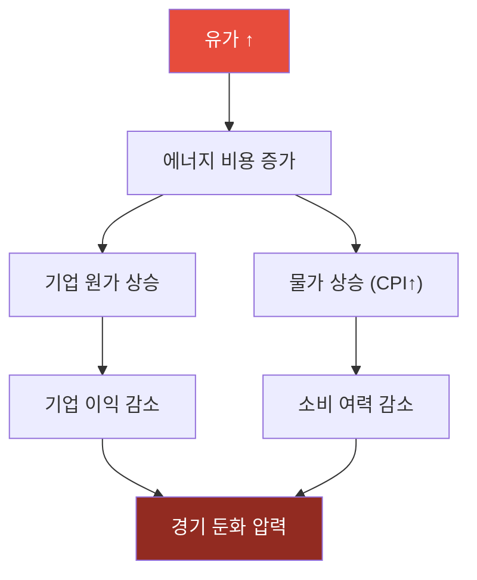

**유가 하락 시 경제 파급 경로**

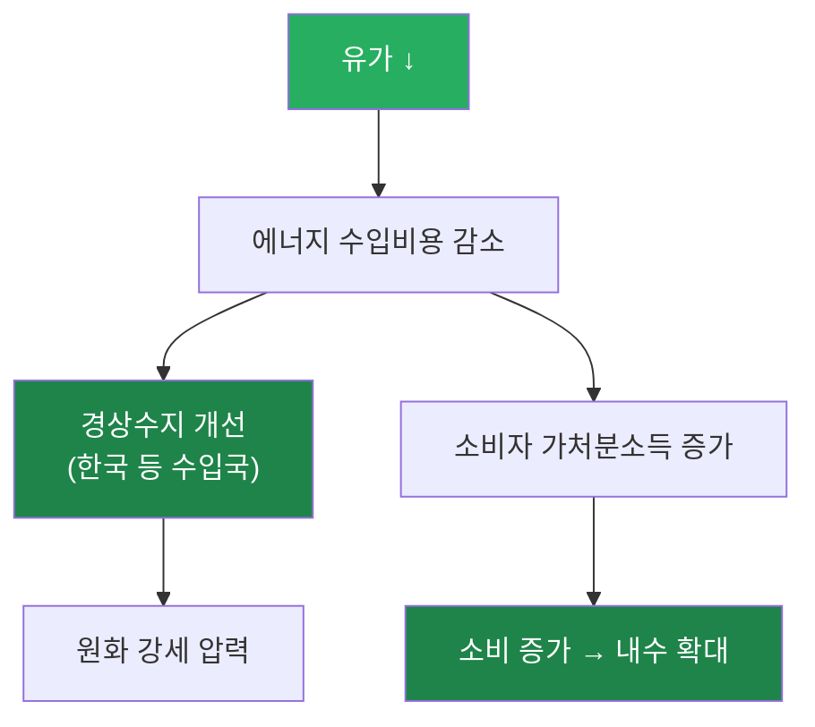

**산업별 유가 영향**

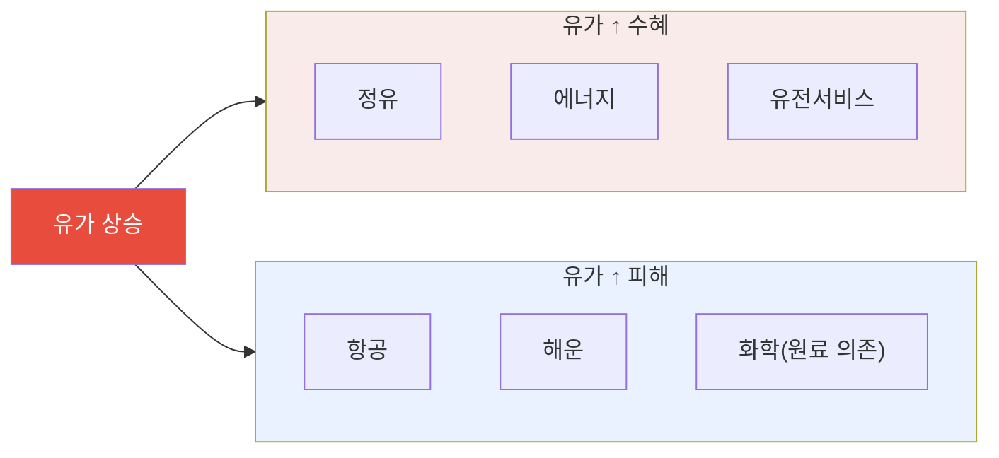

> 📺 [🎬 유가 상승 하락 주식시장 영향](https://www.youtube.com/results?search_query=유가+주식+영향+에너지+섹터+한국어)

```python
import yfinance as yf
import pandas as pd

# WTI 원유 선물 가격 (CL=F) 수집
oil = yf.download("CL=F", start="2022-01-01", end="2024-12-31", auto_adjust=True)["Close"]

# 20일 이동평균 추가
oil_ma20 = oil.rolling(20).mean()

print(f"최근 종가: ${oil.iloc[-1]:.2f}/배럴")
print(f"20일 이동평균: ${oil_ma20.iloc[-1]:.2f}/배럴")
print(f"52주 최고: ${oil[-252:].max():.2f}")
print(f"52주 최저: ${oil[-252:].min():.2f}")
```
#### 위의 예시 실행 시
```
(.venv) root@DESKTOP-CLQV18N:/home/ubuntu/investment-analysis/test# python3 0201.py
[*********************100%***********************]  1 of 1 completed
Traceback (most recent call last):
  File "/home/ubuntu/investment-analysis/test/0201.py", line 10, in <module>
    print(f"최근 종가: ${oil.iloc[-1]:.2f}/배럴")
                        ^^^^^^^^^^^^^^^^^^
TypeError: unsupported format string passed to Series.__format__
```
#### 오류 해결 하세요.


#### 🔗 Python 소스 연계

웹앱 **거시경제현황 1 (실시간)** 에서 WTI 유가를 실시간으로 조회합니다.

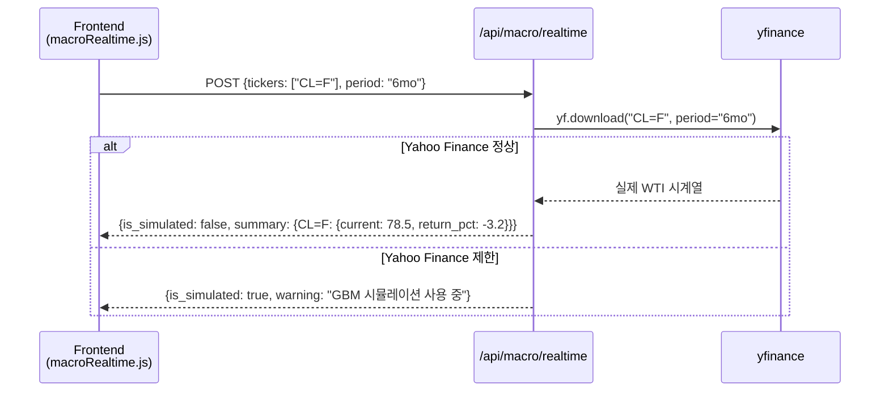

| API 파라미터 | 유가 조회용 값 |
|---|---|
| `tickers` | `["CL=F"]` (WTI 선물) |
| `period` | `"1y"` (연간 추세 파악 권장) |

---

### 3. 환율과 주가의 관계

> 📖 **Wikipedia**: [환율](https://ko.wikipedia.org/wiki/환율) · [외환시장](https://ko.wikipedia.org/wiki/외환시장)

**환율의 기본 개념**

환율은 두 통화의 교환 비율입니다. 원/달러 환율이 1,350원이라면, 달러 1개를 사려면 1,350원이 필요하다는 뜻입니다.

**원화 약세(환율 ↑) 파급 경로**

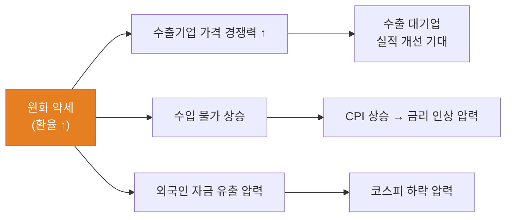

**원화 강세(환율 ↓) 파급 경로**

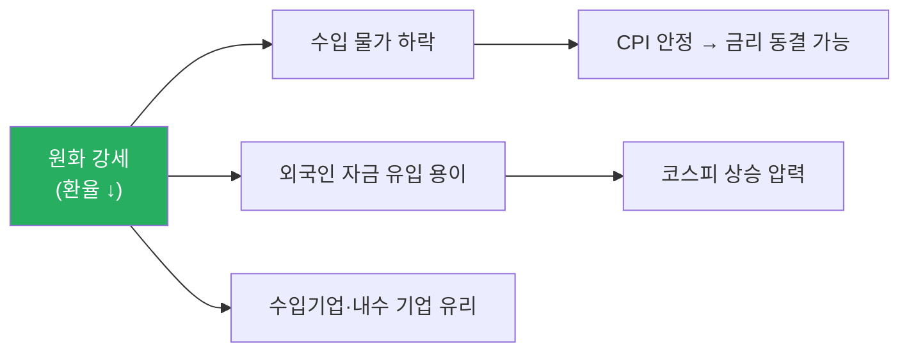

**코스피와 환율의 상호작용**

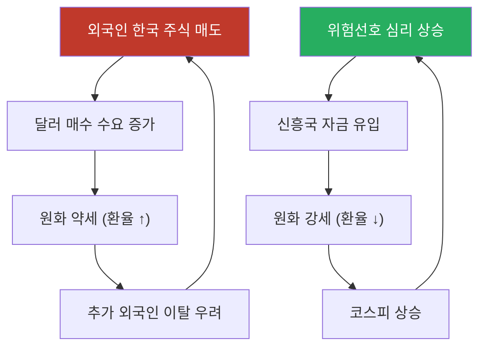

> 📺 [🎬 원달러 환율 주식 관계](https://www.youtube.com/results?search_query=원달러+환율+주식시장+관계+한국어)

> 📺 [🎬 외국인 투자자 환율 코스피 영향](https://www.youtube.com/results?search_query=외국인+투자자+코스피+환율+한국어)

```python
import yfinance as yf
import pandas as pd
import numpy as np

# 원달러 환율 (KRW=X) 및 코스피 ETF (EWY)
usdkrw = yf.download("KRW=X", start="2022-01-01", end="2025-12-31", auto_adjust=True)["Close"]
kospi  = yf.download("EWY",   start="2022-01-01", end="2025-12-31", auto_adjust=True)["Close"]

df = pd.DataFrame({"환율": usdkrw, "코스피ETF": kospi}).dropna()

correlation = df["환율"].corr(df["코스피ETF"])
print(f"원달러 환율 vs 코스피ETF 상관계수: {correlation:.3f}")
print("(음수: 환율 상승 시 코스피 하락 경향)")
```

#### 🔗 Python 소스 연계

환율(USD/KRW)과 코스피를 동시에 조회해 상관관계를 웹앱에서 시각화합니다.

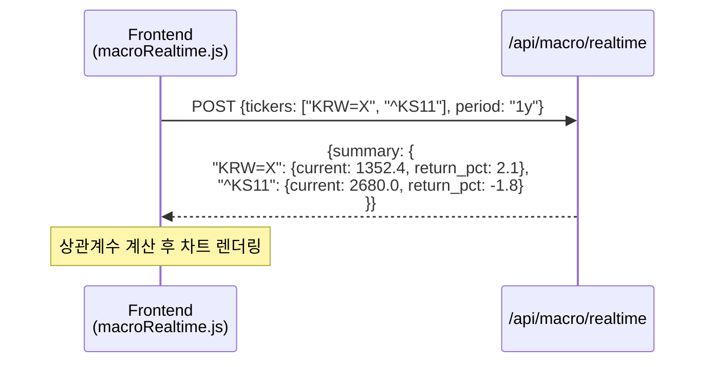

| 환율·주가 동시 조회 파라미터 | 설명 |
|---|---|
| `"KRW=X"` | 달러/원 환율 |
| `"^KS11"` | KOSPI 지수 |
| `"EWY"` | iShares MSCI Korea ETF (대안) |

### 3-1. 외국인의 주가상승 신호

> 📖 **Wikipedia**: [외국인 투자자](https://ko.wikipedia.org/wiki/외국인_투자자) · [코스피](https://ko.wikipedia.org/wiki/코스피)

한국 주식시장에서 **외국인 투자자**는 코스피 시가총액의 약 30~35%를 차지하는 핵심 수급 세력입니다. 외국인의 순매수·순매도 동향은 주가 방향의 중요한 선행 지표로 활용됩니다.

**외국인 순매수가 주가 상승 신호로 해석되는 구조**

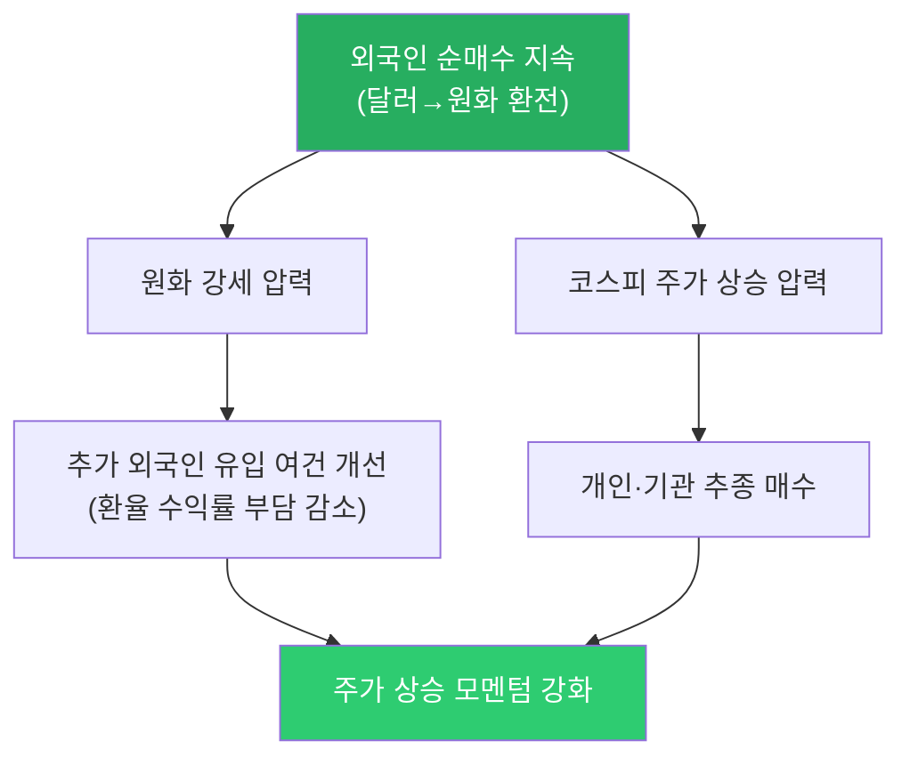

**외국인 주가상승 신호 체크 포인트**

| 신호 | 확인 방법 | 신뢰도 |
|------|---------|--------|
| **5일 이상 연속 순매수** | KRX 투자자별 매매동향 | ★★★★★ |
| **외국인 보유비율 지속 증가** | data.krx.co.kr 종목별 외국인 보유 현황 | ★★★★☆ |
| **원화 강세 동반** | USD/KRW 환율 하락 추세 | ★★★☆☆ |
| **대형주 중심 매수** | 코스피200 핵심 종목 집중 매수 | ★★★★☆ |
| **거래대금 동반 증가** | 순매수 + 거래대금 급증 | ★★★★☆ |

**외국인 매수 vs 매도 시 시장 반응 비교**

| 외국인 동향 | 환율 영향 | 주가 영향 | 투자자 대응 |
|------------|---------|---------|-----------|
| **대규모 순매수** | 원화 강세 (환율 ↓) | 코스피 상승 압력 | 비중 확대 검토 |
| **5일 이상 연속 순매수** | 원화 강세 지속 | 강한 상승 모멘텀 | 모멘텀 추종 전략 |
| **대규모 순매도** | 원화 약세 (환율 ↑) | 코스피 하락 압력 | 리스크 점검·손절 기준 확인 |
| **연속 순매도** | 원화 약세 심화 | 추가 이탈 악순환 가능 | 방어 포지션 검토 |

```python
import yfinance as yf
import pandas as pd

# 외국인 순매수 모멘텀과 코스피 관계 (개념 예시)
# 실제 외국인 매매동향은 KRX data.krx.co.kr에서 다운로드

# 코스피 ETF (EWY)와 원달러 환율 동반 조회
data = yf.download(["EWY", "KRW=X"], start="2023-01-01", end="2024-12-31",
                   auto_adjust=True)["Close"]
data.columns = ["코스피ETF", "환율"]

# 코스피 ETF 수익률과 환율 변화 계산
data["코스피수익"] = data["코스피ETF"].pct_change() * 100
data["환율변화"]   = data["환율"].pct_change() * 100

# 외국인 순매수 가정: 환율이 내려가는 날 → 달러→원화 전환 압력 (순매수 추정)
data["외국인매수추정"] = data["환율변화"] < 0  # 단순 추정

# 외국인 추정 매수일의 코스피 평균 수익률
buy_days  = data[data["외국인매수추정"]]["코스피수익"].mean()
sell_days = data[~data["외국인매수추정"]]["코스피수익"].mean()

print(f"외국인 추정 순매수일 평균 코스피 수익률: {buy_days:.3f}%")
print(f"외국인 추정 순매도일 평균 코스피 수익률: {sell_days:.3f}%")
```

> ⚠️ **주의사항**: 외국인 순매수가 항상 주가 상승으로 이어지지는 않습니다. 파생상품 헤지, 인덱스 리밸런싱, 배당 차익거래 목적의 매수는 주가 상승 신호로 보기 어렵습니다. **순매수의 지속성, 대상 종목, 환율 동향, 거래대금**을 종합해 판단해야 합니다.

---

### 4. 실업률, GDP 성장률 지표 해석

> 📖 **Wikipedia**: [실업률](https://ko.wikipedia.org/wiki/실업률) · [국내총생산](https://ko.wikipedia.org/wiki/국내총생산) · [경기침체](https://ko.wikipedia.org/wiki/경기침체)

**GDP 성장률 (Gross Domestic Product Growth Rate)**

GDP는 일정 기간 국내에서 생산된 모든 재화·서비스의 시장 가치 합계입니다.

- **성장률 = (금기 GDP - 전기 GDP) / 전기 GDP × 100**
- 분기별 발표 (QoQ: 전분기 대비, YoY: 전년 동기 대비)

**GDP 성장률 구간별 신호**

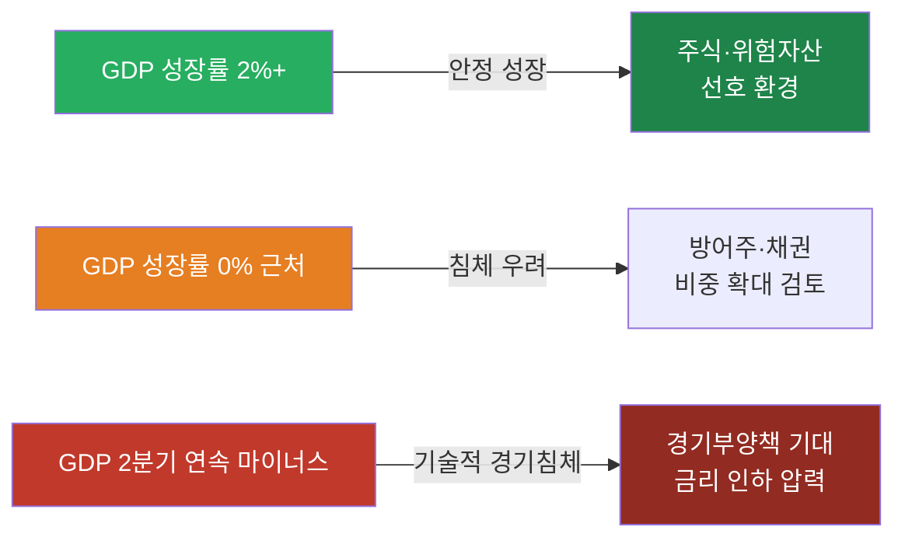

> 📺 [🎬 GDP 성장률 경기침체 투자](https://www.youtube.com/results?search_query=GDP+성장률+경기침체+주식투자+한국어)

**실업률 (Unemployment Rate)**

경제활동인구 중 일할 의사가 있으나 직업이 없는 사람의 비율입니다.

**실업률 신호와 시장 반응**

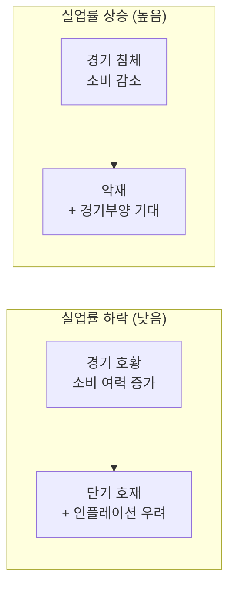

> 📺 [🎬 미국 실업률 비농업고용지수 주식](https://www.youtube.com/results?search_query=미국+실업률+비농업고용+주식시장+한국어)

**미국 고용지표 발표 순서**


| 지표 | 발표 시기 | 핵심 수치 |
|------|-----------|-----------|
| 비농업 고용(NFP) | 매월 첫째 금요일 | 전월 대비 증감 인원 |
| 실업률 | NFP 동시 발표 | % |
| ADP 민간 고용 | NFP 발표 2일 전 수요일 | 선행 지표 |

#### 🔗 Python 소스 연계

GDP·실업률은 yfinance로 직접 수집되지 않지만, 금리(채권 수익률)를 프록시 지표로 활용해 웹앱에서 조회할 수 있습니다.

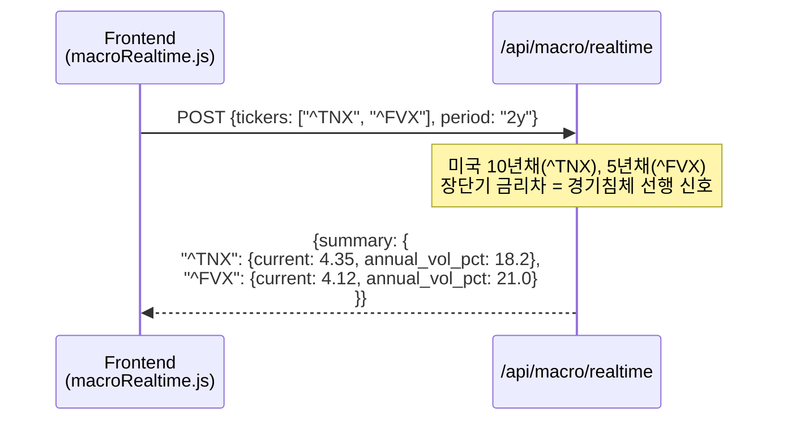

---

### 5. 실습: 주요 경제지표 데이터 수집 및 상관관계 분석

이번 실습은 **시장 데이터만 빠르게 확인하는 yfinance 버전**과 **공식 경제통계 API를 함께 쓰는 확장 버전**으로 나눕니다. 최종 산출물은 `macro_correlation.csv`, `macro_correlation.png`, `macro_rolling_corr.png`, `macro_report.md`입니다.

---

#### 5-1. 실습 목표와 분석 질문

**실습 목표**

1. CPI, PPI, GDP, 실업률, 금리, 유가, 환율, 주가지수 데이터를 수집합니다.
2. 일별·월별·분기별로 다른 데이터 빈도를 월별 기준으로 맞춥니다.
3. 수준값(level), 변화율(return), 전년동월비(YoY)를 구분해 상관관계를 계산합니다.
4. 전체 기간 상관관계뿐 아니라 12개월 롤링 상관관계와 선행·후행 관계를 확인합니다.
5. 웹앱 API와 연결할 수 있는 데이터 구조와 화면 구성을 설계합니다.

**분석 질문 예시**

| 질문 | 필요한 지표 | 분석 방법 |
|---|---|---|
| 유가 상승은 물가 상승과 함께 움직였는가? | WTI, CPI, PPI | 월별 YoY 상관계수, 3개월 시차 상관 |
| 달러 강세는 주가지수에 부정적인가? | 달러인덱스, USD/KRW, S&P500, KOSPI | 월간 수익률 상관계수 |
| 금리 상승기에 금 가격은 약했는가? | 10년물 금리, 금, 달러인덱스 | 산점도, 롤링 상관 |
| 경기 둔화 신호와 주식시장은 언제 연결되는가? | 실업률, GDP, 장단기금리차, S&P500 | 분기/월별 리샘플링, 시차 상관 |

---

#### 5-2. 데이터 출처와 가입/키 발급

실습에서는 `yfinance`로 빠르게 시작한 뒤, 공식 API를 하나씩 붙이는 순서를 권장합니다.

| 출처 | 주요 지표 | 인증 | 실습 용도 |
|---|---|---|---|
| [Yahoo Finance/yfinance](https://pypi.org/project/yfinance/) | WTI, 금, 달러인덱스, S&P500, KOSPI, 환율, 미국채 | 별도 키 없음 | 빠른 시장 데이터 실습 |
| [한국은행 ECOS](https://ecos.bok.or.kr/) | 기준금리, 환율, GDP, CPI, 시장금리 | API Key 필요 | 한국 거시지표 수집 |
| [KOSIS OpenAPI](https://kosis.kr/openapi/devGuide/devGuide_0201List.do) | 소비자물가, 실업률, 산업활동 | API Key 필요 | 통계청 공식 통계 수집 |

`.env`에는 아래처럼 키를 저장합니다. 키가 없어도 yfinance와 일부 공개 API 실습은 가능합니다.

```bash
BOK_API_KEY=발급받은_ECOS_KEY
KOSIS_API_KEY=발급받은_KOSIS_KEY
```

**추가 패키지**

현재 repo의 기본 패키지에 더해, 아래 패키지를 설치하면 실습 코드를 그대로 실행하기 쉽습니다.

```bash
pip install requests seaborn plotly statsmodels openpyxl
```

---

#### 5-4. 1단계: yfinance로 빠른 시장 데이터 수집

먼저 일별 금융시장 데이터를 수집합니다. 이 단계는 API Key가 없어도 실행할 수 있어 실습 진입점으로 좋습니다.

```python
import yfinance as yf
import pandas as pd

MARKET_TICKERS = {
    "WTI": "CL=F",
    "Gold": "GC=F",
    "DollarIndex": "DX-Y.NYB",
    "US10Y": "^TNX",
    "SP500": "^GSPC",
    "KOSPI": "^KS11",
    "USDKRW": "KRW=X",
}

def fetch_yfinance_close(tickers, start="2022-01-01", end="2025-12-31"):
    frames = {}
    for name, ticker in tickers.items():
        data = yf.download(
            ticker,
            start=start,
            end=end,
            auto_adjust=True,
            progress=False,
        )
        if data.empty:
            print(f"skip: {name} ({ticker})")
            continue
        frames[name] = data["Close"]
    return pd.DataFrame(frames).sort_index()

daily_prices = fetch_yfinance_close(MARKET_TICKERS)
daily_prices.to_csv("macro_market_daily.csv", encoding="utf-8-sig")
print(daily_prices.tail())
```

**주의할 점**

- `^TNX`는 미국 10년물 금리 자체가 아니라 Yahoo Finance 표기상 10배 조정된 수익률처럼 보일 수 있으므로, 화면 표시 전에 단위와 스케일을 확인합니다.
- `KRW=X`는 USD/KRW 환율입니다. 값이 오르면 원화 약세입니다.
- 선물 가격(`CL=F`, `GC=F`)은 롤오버 영향이 있어 장기 분석에서는 공식 현물 또는 연속선물 정의를 확인합니다.

---
---

# 소부장이란?

**소부장**은 ‘소재·부품·장비’의 줄임말로, 반도체·배터리·디스플레이·자동차 등 한국 제조업의 핵심 기반을 뜻합니다.  
특히 2019년 일본의 반도체 소재 수출 규제 이후 기술 자립과 공급망 안정화를 위해 국가적으로 강조된 개념입니다.

---

## 📌 소부장의 의미
- **소재**: 제품을 만드는 원재료 (예: 실리콘 웨이퍼, OLED 발광 소재).
- **부품**: 소재를 가공해 완제품에 들어가는 기능 단위 (예: 카메라 모듈, 메모리 반도체).
- **장비**: 소재·부품을 생산·조립하는 기계 및 설비 (예: 반도체 노광 장비, 디스플레이 증착 장비).

---

## ⚙️ 왜 중요한가?
- 산업 경쟁력 강화: 핵심 소재·부품을 안정적으로 공급 → 완제품 품질 향상
- 경제 안보: 해외 의존도를 줄여 공급망 위기 대응
- 성장 동력: 첨단 기술 확보 시 자체적으로 수출 산업으로 발전 가능

---

## 🔑 소부장과 한국 산업
- 반도체 소부장: 삼성전자·SK하이닉스에 장비·소재 납품 (EUV 공정 장비, HBM용 소재)
- 배터리 소부장: 전기차 배터리용 양극재·음극재·전해액
- 디스플레이 소부장: OLED 패널용 필름, 증착 장비

---

## 📊 소부장 관련 기업 예시

| 기업 | 산업군 | 주요 제품 |
|---|---|---|
| 삼성전자 | 반도체 | 메모리, 칩셋 |
| 엘앤에프 | 소재 | 2차전지 양극재 |
| 원익IPS | 장비 | 반도체 제조 장비 |
| 에코프로비엠 | 소재 | 전기차 배터리 소재 |
| 한화에어로스페이스 | 부품 | 항공기·방산 부품 |

---

## 🚨 투자·경제적 관점
- 정부 지원: R&D 세제 혜택, 국책 과제 참여 기업에 자금 지원
- 투자 전략: 개별 종목 대신 소부장 ETF (예: KODEX 반도체소부장, TIGER 소부장) 활용 가능
- 위험 요소: 대기업보다 변동성 큼 → 분할 매수 권장
