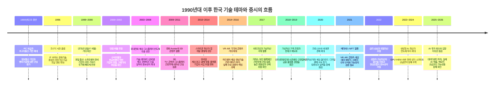

# 주식 1

주식 1에서는 경제 순환, 산업 구조, 기업 공시를 연결해 살펴봅니다. **산업**은 비슷한 제품·서비스를 제공하며 경쟁하거나 협력하는 기업들의 집합입니다.

## 경제 순환: 회복·확장·둔화·수축

경제는 생산·소비·고용·투자가 서로 영향을 주며 변화합니다. 전형적으로는 다음 네 국면으로 설명할 수 있습니다.

1. **회복**: 침체 이후 생산과 소비가 서서히 개선되고, 고용과 투자도 점차 회복될 수 있습니다.
2. **확장**: 기업 활동과 소비가 활발해지면서 매출·고용·설비투자가 증가하는 국면입니다.
3. **둔화**: 경제는 계속 성장할 수 있지만, 성장률과 수요 증가 속도가 약해지는 시기입니다.
4. **수축**: 소비와 생산이 줄고 기업이 채용·투자를 보수적으로 운영하는 국면입니다.

국면의 순서·기간·강도는 매번 다릅니다. 따라서 한 건의 뉴스나 한 개의 지표만으로 경기 방향을 단정해서는 안 됩니다.

## 산업 구조와 경쟁 환경

기업을 평가할 때는 개별 회사뿐 아니라 그 회사가 속한 산업의 경쟁 구조를 함께 분석해야 합니다.

- **새 회사가 쉽게 들어올 수 있나?**
- **비슷한 물건으로 바꿀 수 있나?**
- **손님이 가격을 깎자고 할 힘이 큰가?**
- **재료를 파는 쪽의 힘이 큰가?**
- **같은 일을 하는 회사끼리 경쟁이 심한가?**

이 다섯 가지 질문은 산업이 얼마나 힘든지 생각하는 데 도움이 됩니다.

## 기업의 공식 정보: 공시

회사는 투자 판단에 중요한 사실을 **공시**로 알립니다. 우리나라에서는 **DART(Data Analysis, Retrieval and Transfer System, 전자공시시스템)**에서 사업보고서, 대규모 계약, 신주 발행 등을 확인할 수 있습니다.

- 새 주식을 많이 만들면 기존 주주의 몫이 작아질 수 있습니다.
- 회사가 자기 주식을 사들이면 시장에 나온 주식 수가 줄 수 있습니다.
- 좋은 소식도 나쁜 소식도 원문과 날짜를 함께 봅니다.

## 산업을 비교하는 방법

| 살펴볼 것 | 쉬운 질문 |
| --- | --- |
| 제품 | 사람들은 왜 이 물건을 살까요? |
| 경쟁 | 다른 회사가 쉽게 따라 할 수 있습니까? |
| 손님 | 손님이 계속 늘고 있습니까? |
| 비용 | 재료값이나 전기값이 크게 오르나요? |
| 위험 | 법, 날씨, 전쟁, 환율 같은 일이 영향을 주나요? |

## 핵심 정리

유행하는 산업이라고 모든 회사가 잘되는 것은 아니에요. 내가 이해할 수 있는 회사와 산업을 천천히 살펴보는 것이 좋습니다.

> 이 자료는 공부용입니다. 주식 가격이 오른다고 약속하지 않습니다.

## 경제 뉴스는 이렇게 읽습니다

경제 뉴스에는 금리, 물가, 환율, 수출 같은 말이 자주 나옵니다. 이 말들은 서로 연결되어 있습니다.

- **금리**가 오르면 돈을 빌리는 일이 부담스러워져서, 회사와 사람 모두 지출을 줄일 수 있습니다.
- **물가**가 너무 빨리 오르면 같은 돈으로 살 수 있는 것이 줄어듭니다.
- **환율**이 오르면 달러를 사는 데 더 많은 원화가 필요합니다. 수입 재료를 많이 쓰는 회사는 비용이 늘 수 있고, 수출 회사에는 도움이 될 수도 있습니다.
- **수출**은 우리나라 물건을 다른 나라에 파는 일입니다. 수출이 늘어도 모든 회사가 똑같이 좋아지는 것은 아니에요.

숫자는 하나씩 보지 말고 ‘왜 바뀌었을까?’를 함께 생각해 보세요.

## 세계 경제에서 한국이 차지하는 위치

한국은 인구와 국토 규모만으로는 대국에 속하지 않지만, 무역과 제조업의 비중이 큰 **개방형 선진 경제**입니다. IMF는 한국을 선진경제(advanced economy)로 분류합니다. 한국 경제는 국내 소비만으로 움직이기보다 해외 수요, 환율, 원자재 가격, 세계 금리와 밀접하게 연결됩니다.

2024년 한국의 상품 수출은 약 **6,838억 달러**로 역대 최고치를 기록했습니다. 산업통상자원부는 WTO 통계를 기준으로 2024년 1~9월 누적 수출 순위가 세계 6위였다고 설명했습니다. 순위는 집계 기간·상품/서비스 포함 여부·환율에 따라 달라질 수 있으므로, 특정 순위 자체보다 한국이 세계 교역에서 큰 비중을 가진 수출국이라는 점을 이해하는 것이 중요합니다.

| 관점 | 한국 경제의 특징 | 주식·경제 뉴스에서 확인할 점 |
| --- | --- | --- |
| 수출 | 반도체, 자동차, 선박, 석유제품, 기계, 배터리 소재 등 제조업 수출의 비중이 큽니다. | 세계 경기, 해외 주문, 주요 수출 품목의 가격·물량이 기업 실적에 미치는 영향을 확인합니다. |
| 공급망 | 미국·중국·유럽·일본·대만 등과 부품·장비·기술·판매망이 연결되어 있습니다. | 관세, 수출 통제, 물류 차질, 특정 국가의 경기 변화가 어느 업종에 영향을 주는지 구분합니다. |
| 에너지·원자재 | 원유·가스·광물 등 많은 원자재를 해외에서 들여옵니다. | 유가와 원자재 가격 상승은 수입 비용과 물가를 높일 수 있으며, 업종별 영향은 다릅니다. |
| 금융시장 | 원화는 달러, 미국 금리, 외국인 자금 흐름에 영향을 받습니다. | 환율 변화가 수출 기업의 원화 매출, 수입 기업의 비용, 외국인 투자자의 수익률에 어떻게 연결되는지 봅니다. |
| 기술 경쟁력 | 메모리 반도체, 디스플레이, 조선, 자동차 등에서 세계 공급망에 중요한 기업이 있습니다. | 한 산업의 호황이 한국 전체 경제를 대표한다고 단정하지 말고, 품목·기업별 경쟁력과 수요를 따로 확인합니다. |

### 한국 경제를 볼 때 함께 생각할 강점과 과제

한국의 강점은 높은 제조 역량, 빠른 기술 상용화, 세계 시장에 진출한 기업들입니다. 반면 수출 비중이 높기 때문에 세계 경기 둔화나 교역 갈등의 영향을 크게 받을 수 있습니다. 특정 품목, 특히 반도체의 경기 변동이 수출·설비투자·증시에 크게 전달되는 점도 특징입니다.

또한 에너지·원자재 수입 의존, 저출생·고령화에 따른 인구 구조 변화, 가계와 기업의 이자 부담, 지정학적 위험은 장기적으로 점검해야 할 과제입니다. 이런 과제는 한국 경제가 약하다는 뜻이 아니라, 경제 뉴스를 읽을 때 성장 요인과 위험 요인을 함께 보아야 한다는 의미입니다.

### 투자자가 연결해 보는 질문

1. 세계 수요 변화가 한국의 어떤 수출 품목과 기업에 먼저 영향을 줄 수 있는가?
2. 원/달러 환율 변화는 매출·원가·외국인 자금 흐름에 각각 어떤 영향을 주는가?
3. 미국·중국의 정책 변화가 한국 기업의 고객, 공급망, 경쟁사에 어떤 변화를 만드는가?
4. 수출 증가가 물량 증가인지, 가격 상승 때문인지, 특정 품목만의 변화인지 구분했는가?

> 참고 자료: [산업통상자원부 2024년 수출 실적](https://english.motie.go.kr/eng/13/topics/2/view?bbsCdN=2&bbsSeqN=2185&ctgCdN=2&pageIndex=9), [WTO 한국 무역 프로필](https://ttd.wto.org/en/profiles/korea-republic-of), [IMF WEO 경제 분류](https://data.imf.org/Datasets/WEO/Groups-and-Aggregates-April-2025). 수출액·순위·경제 전망은 발표 시점과 통계 기준에 따라 바뀔 수 있습니다.

## 기술 변화와 한국 증시: 1990년대 이후 연대기

한국 증시는 새로운 기술이 등장할 때마다 관련 기업의 성장 가능성을 먼저 평가해 왔습니다. 다만 기술이 주가를 자동으로 올리는 것은 아닙니다. 기대가 빠르게 커진 뒤 실제 매출·이익·현금흐름이 따라오지 못하면 주가가 크게 조정될 수 있습니다. 아래 연대기는 기술 변화, 산업 구조, 투자 심리가 어떻게 연결되었는지 이해하기 위한 학습용 정리입니다.

### 한눈에 보는 기술 테마와 거시경제의 연결

아래 인포그래픽은 앞의 연대기를 바탕으로 기술 변화, 금리·환율·유동성, 기업 실적과 공시가 어떻게 이어지는지 한 화면에 정리한 자료입니다. 기술 테마가 화제가 되더라도 실제 투자 판단에서는 글로벌 수요, 금리와 환율, 기업의 매출·이익·설비투자를 차례로 확인해야 합니다.

*그림을 읽을 때에는 화살표를 인과관계로 단정하지 말고, 각 단계의 공시·실적·거시 지표로 실제 연결 여부를 확인합니다.*

### 시기별로 무엇이 달랐는가

| 시기 | 기술·산업의 핵심 변화 | 증시에서 나타난 관심 | 학습할 점 |
| --- | --- | --- | --- |
| 1990년대 후반~2000년대 초 | 인터넷 보급과 벤처 투자 확대 | 인터넷·통신·소프트웨어 기업의 성장 기대 | 이용자 수나 기술 화제만으로는 기업가치를 판단할 수 없으며, 수익모델과 재무 안전성을 확인해야 합니다. |
| 2000년대 중후반 | 휴대전화, 게임, 디스플레이, 메모리 반도체의 수출 확대 | 제조 경쟁력과 세계 시장 점유율 | 기술은 제품 경쟁력·원가·해외 고객·환율과 결합될 때 기업 실적으로 이어집니다. |
| 2009~2016년 | 3D·스마트폰·앱·VR/AR 등 사용자 경험 중심 기술의 등장 | 콘텐츠, 모바일 플랫폼, 부품, 게임 테마 | 신기술은 기대가 앞서기 쉽습니다. 실제 기기 판매, 서비스 이용자, 반복 매출을 따로 확인해야 합니다. |
| 2017~2022년 | 가상자산, 핀테크, 메타버스와 디지털 플랫폼의 성장 | 거래소·보안·결제·블록체인·콘텐츠 관련주 | 24시간 거래, 규제 변화, 금리와 유동성은 위험자산 가격에 큰 영향을 줄 수 있습니다. |
| 2023년 이후 | 생성형 AI와 대규모 데이터센터 투자 | AI 반도체, 메모리, 장비·소재, 서버·전력·냉각, 소프트웨어 | AI 기대는 공급망 전체에 고르게 배분되지 않습니다. 고객의 설비투자와 공급사의 실제 매출·마진·재고를 함께 봐야 합니다. |

### 기술 테마를 읽는 공통 원칙

1. **기술의 화제성과 기업의 수익성은 구분합니다.** 새로운 서비스가 주목받아도 누가 돈을 벌고 언제 현금흐름이 생기는지는 별도 문제입니다.
2. **공급망을 나누어 봅니다.** 플랫폼, 콘텐츠, 부품, 장비, 소재, 전력처럼 같은 기술 안에서도 수혜를 받는 방식이 다릅니다.
3. **금리와 유동성을 확인합니다.** 먼 미래의 성장을 기대하는 기업일수록 금리 변화와 투자 심리에 민감할 수 있습니다.
4. **정책과 규제를 확인합니다.** 가상자산·개인정보·플랫폼·AI는 법과 제도의 변화가 사업 모델에 직접 영향을 줄 수 있습니다.
5. **테마 이름보다 공시와 실적을 우선합니다.** 계약 규모, 고객, 매출 인식 시점, 투자 비용, 재고와 부채를 원문 자료에서 확인해야 합니다.

> 참고 자료: [한국거래소의 코스닥 시장 소개](https://global.krx.co.kr/contents/GLB/02/0201/0201010301/GLB0201010301.jsp)와 [금융위원회의 인터넷전문은행 출범 자료](https://www.fsc.go.kr/eng/pr010101/22158), [오픈뱅킹 시행 자료](https://www.fsc.go.kr/eng/pr010101/22247)를 참고했습니다. 가상자산 시장의 높은 변동성과 이른바 ‘김치 프리미엄’ 사례는 [IMF 세계금융안정보고서](https://www.imf.org/en/-/media/files/publications/gfsr/2021/october/english/text.pdf)에서도 설명합니다.

## 시황·공시를 확인하는 외부 자료

방송과 뉴스는 시장의 쟁점을 빠르게 파악하는 데 유용하지만, 매수·매도 판단의 근거가 될 수는 없습니다. 방송에서 언급한 기업·계약·정책은 반드시 공시와 원문 자료로 다시 확인합니다. 아래 링크는 학습 화면에서 별도 창으로 열립니다.

### 국내 경제·증권 방송

- [한국경제TV](https://www.wowtv.co.kr/): 국내외 증시·산업·경제 이슈를 다루는 경제 전문 방송입니다.
- [매일경제TV](https://www.mktv.co.kr/): 경제·증권 방송과 시황 정보를 제공합니다.
- [서울경제TV SEN](https://www.sentv.co.kr/): 국내 증시와 산업 이슈를 다룹니다.
- [이데일리TV](https://tv.edaily.co.kr/): 금융·산업·정책 뉴스를 영상으로 확인할 수 있습니다.
- [MTN 머니투데이방송](https://www.mtn.co.kr/): 국내외 시장과 기업 이슈를 다룹니다.
- [토마토증권통](https://www.tomato-tong.com/): 국내 증시 시황과 투자 교육 콘텐츠를 제공합니다.
- [SBS Biz](https://biz.sbs.co.kr/): 경제·산업 뉴스와 시황 프로그램을 제공합니다.

IPTV 채널 번호와 편성은 통신사·상품·지역에 따라 달라질 수 있으므로, 채널명과 공식 편성표를 함께 확인합니다.

### 해외 시장·세계 경제 뉴스

- [Bloomberg Television](https://www.bloomberg.com/live): 세계 증시, 금리, 환율, 원자재, 기업 뉴스를 확인할 수 있습니다.
- [CNBC Markets](https://www.cnbc.com/markets/): 미국 시장의 개장·마감과 기업 실적 보도를 참고할 수 있습니다.
- [Reuters Markets](https://www.reuters.com/markets/): 통신사 기사로 세계 시장과 주요 경제 뉴스를 비교할 수 있습니다.
- [Yahoo Finance](https://finance.yahoo.com/): 미국 종목의 시세, 실적 일정, 기본 지표를 찾아볼 수 있습니다.

### 투자 판단의 우선순위: 공식 원문

- [DART 전자공시](https://dart.fss.or.kr/): 사업보고서, 실적, 유상증자, 감사 의견 등 국내 기업의 공시 원문을 확인합니다.
- [KIND 한국거래소 공시](https://kind.krx.co.kr/): 상장회사 공시와 시장 정보를 확인합니다.
- [한국거래소(KRX)](https://www.krx.co.kr/): 시장 제도, 지수, 상장·공시 관련 공식 정보를 제공합니다.
- [금융감독원(FSS)](https://www.fss.or.kr/): 금융소비자 정보와 제도 안내를 확인합니다.

## 산업의 생애주기

산업은 도입·성장·성숙·쇠퇴에 가까운 단계를 거치는 경우가 많습니다. 수요가 빠르게 늘면 경쟁 기업도 증가하고, 시간이 지나면 시장 성장률이 낮아지거나 대체 기술이 등장할 수 있습니다.

| 산업의 모습 | 쉬운 질문 |
| --- | --- |
| 시작 | 새 물건을 누가 처음 쓰고 있습니까? |
| 성장 | 손님과 매출이 빠르게 늘고 있습니까? |
| 안정 | 큰 회사들이 자리를 잡았나요? |
| 변화 | 다른 기술이나 물건이 대신하고 있습니까? |

반도체, 자동차, 게임, 음식처럼 서로 다른 산업은 자라는 속도와 위험이 다릅니다. 그래서 ‘인기 산업’이라는 말보다 실제 손님·경쟁·비용을 확인하는 편이 좋습니다.

## 반도체 산업을 볼 때

반도체는 휴대전화, 자동차, 컴퓨터, 서버에 들어가는 중요한 부품입니다. 하지만 반도체 회사의 실적은 오르내림이 큰 편입니다. 물건이 부족할 때는 가격이 오르다가, 회사들이 너무 많이 만들면 가격이 내려갈 수 있습니다.

반도체 뉴스를 볼 때는 다음을 차례로 살펴보세요.

1. 사람들이 휴대전화·컴퓨터·**AI(Artificial Intelligence, 인공지능)** 서버를 더 많이 사고 있습니까?
2. 회사들이 공장과 장비에 돈을 얼마나 쓰고 있습니까?
3. 재고가 쌓이고 있지는 않나요?
4. 한 회사만 좋은지, 산업 전체가 좋아지는지 구분할 수 있습니까?

## 2026년 6~7월 반도체 뉴스, 이렇게 묶어 읽습니다

2026년 6~7월처럼 반도체 기대가 큰 시기에는 ‘AI 때문에 반도체가 오른다’라는 한 문장만으로 시장을 이해하기 어려워요. 반도체 업황의 **피크(경기가 가장 좋다고 기대되는 꼭대기)** 우려와, **하이퍼스케일러(Hyperscaler, 아주 큰 데이터센터를 운영하며 클라우드·AI 서비스에 대규모로 투자하는 기업)**의 투자가 계속될 가능성을 함께 봐야 합니다.

이 절은 당시의 가격을 맞히기 위한 글이 아니에요. 2026년 6~7월에 나온 뉴스와 실적 자료를 읽을 때 어떤 사실이 서로 연결되는지 정리한 학습용 틀입니다. 실제 수치·발표일·정책 내용은 해당 기업의 실적 자료, DART, 거래소 공시와 공식 발표에서 다시 확인하세요.

### 먼저 연결해 볼 세계 뉴스 다섯 가지

| 세계 뉴스거리 | 반도체와 연결되는 이유 | 확인할 자료 |
| --- | --- | --- |
| 미국 대형 클라우드 기업의 AI·데이터센터 투자 계획 | 서버, AI 가속기, 고대역폭 메모리(HBM), 네트워크 장비 수요에 영향을 줄 수 있습니다. | 분기 실적 발표 자료의 설비투자(Capex)·데이터센터 투자 설명 |
| AI 반도체·메모리 기업의 공급 계획 | 주문이 많아도 생산 능력과 수율이 따라가지 못하면 매출은 늦어질 수 있습니다. 반대로 증설이 너무 빠르면 나중에 공급 과잉 위험이 생겨요. | 기업 실적 자료, 생산능력·재고·고객 주문 관련 설명 |
| 미국·중국의 수출 통제와 공급망 정책 | 어느 나라에 어떤 칩·장비를 팔 수 있는지가 바뀌면 매출 지역, 재고, 투자 계획이 달라질 수 있습니다. | 정부 발표 원문, 기업의 위험요소·지역별 매출 공시 |
| 금리·달러·환율 | 데이터센터 투자비용, 성장주 가치 평가, 수출 기업의 원화 실적에 함께 영향을 줄 수 있습니다. | 중앙은행 발표, 환율·회사 실적의 환율 영향 설명 |
| 대만 해협·물류·전력 같은 공급망 뉴스 | 첨단 칩 생산은 특정 지역과 공장에 많이 모여 있어 공급 차질 위험을 살펴야 합니다. | 기업의 공급망 설명, 정부·거래소의 공식 발표 |

### 하이퍼스케일러가 왜 중요한가요?

하이퍼스케일러는 검색, 클라우드, 동영상, 전자상거래, AI 서비스를 많은 사람에게 제공하기 위해 거대한 데이터센터를 운영합니다. 이 기업들이 서버와 AI 가속기를 더 많이 사면, 그 안에 들어가는 **GPU(Graphics Processing Unit, 복잡한 계산을 빠르게 처리하는 반도체)**, 메모리, 기판, 전력 장비 수요가 커질 수 있습니다.

하지만 ‘투자 계획이 크다’와 ‘반도체 회사의 이익이 계속 커진다’는 같은 말이 아니에요. 하이퍼스케일러는 투자 계획을 바꿀 수 있고, 이전에 주문한 장비가 실제 서비스 매출로 이어지는 데 시간이 걸릴 수 있습니다. 또 AI 서버에 돈이 많이 쓰여도 모든 반도체 종류가 같은 정도로 혜택을 받지는 않습니다. 설계 회사, 파운드리, 메모리, 장비, 소재 회사가 받는 영향은 서로 다릅니다.

### ‘업황 피크’라는 걱정은 무엇일까요?

피크 우려는 ‘수요가 오늘부터 사라진다’는 뜻이 아니에요. 시장이 앞으로의 좋은 결과를 이미 가격에 많이 반영했거나, 공급이 너무 빠르게 늘어 다음 해의 가격·이익률이 약해질 수 있다는 걱정입니다. 다음 신호를 함께 봐야 합니다.

| 피크 위험을 살필 신호 | 왜 조심할까요? |
| --- | --- |
| 재고가 매출보다 빠르게 늘어남 | 고객이 실제로 쓰기보다 먼저 많이 사 두었을 가능성이 있습니다. |
| 평균판매가격(Average Selling Price, ASP)이 약해짐 | 평균판매가격은 제품 하나를 평균 얼마에 팔았는지 나타내는 값입니다. 판매량이 같아도 ASP가 낮아지면 매출과 이익률이 줄 수 있습니다. 제품 구성, 할인, 수요·공급, 환율도 함께 확인해야 합니다. |
| 고객의 설비투자 계획이 줄거나 뒤로 밀림 | 데이터센터 장비 주문이 기대보다 늦어질 수 있습니다. |
| 여러 회사가 동시에 큰 증설 발표 | 미래에 공급이 수요보다 많아질 위험이 생길 수 있습니다. |
| 기대가 매우 높은데 실적 전망이 그대로이거나 낮아짐 | ‘나쁜 실적’이 아니어도 시장 기대보다 낮으면 주가가 흔들릴 수 있습니다. |

반대로 재상승 가능성을 살필 때는 AI 수요라는 말보다, 고객의 실제 지출과 주문이 이어지는지 확인합니다. 재고가 건강한 수준이고, 하이퍼스케일러의 투자·AI 서비스 매출이 유지되며, 메모리·파운드리의 가격과 가동률이 함께 개선되는지를 보는 편이 더 구체적입니다.

### 세 가지 시나리오로 나누어 생각합니다

| 시나리오 | 어떤 뉴스 조합일까요? | 투자자가 확인할 질문 |
| --- | --- | --- |
| 수요 지속 | 대형 클라우드 기업의 투자와 AI 서비스 매출이 유지되고, 칩·메모리 주문도 이어져요. | 늘어난 투자가 실제 매출·현금흐름으로 연결되고 있습니까? |
| 기대 조정 | 투자 자체는 이어지지만 증가 속도가 느려지거나, 일부 고객이 주문 시점을 조절합니다. | 가격이 많이 오른 뒤의 기대와 회사 전망 사이에 차이가 있습니까? |
| 업황 하락 위험 | 재고·공급은 늘지만 주문·가격이 약해지고, 고객 투자 계획도 줄어듭니다. | 내 회사는 현금·기술·고객 다변화로 버틸 힘이 있습니까? |

어느 시나리오가 맞는지는 한 번의 뉴스가 아니라 여러 분기 자료로 확인해야 합니다. ‘AI’라는 단어가 들어간 뉴스, 방송의 목표주가, 하루의 급등락만으로 결론 내리지 말고 회사별 매출·재고·설비투자·공시를 비교하세요.

### 2026년 6~7월 뉴스 확인 순서

1. 방송·뉴스에서 나온 주장인지, 기업 또는 정부가 직접 발표한 사실인지 구분합니다.
2. 하이퍼스케일러의 설비투자가 **계획**인지, 실제 지출·가동 중인 데이터센터인지 구분합니다.
3. 반도체 회사의 매출 증가가 판매량, 가격, 환율, 일회성 요인 중 무엇 때문인지 확인합니다.
4. 재고·공급 확대·수출 규제 같은 반대 자료도 함께 찾아봅니다.
5. 내 투자 기간과 감당 가능한 손실을 먼저 확인하고, 한 산업에 과도하게 몰리지 않습니다.

기업의 공식 실적 자료는 각 기업의 투자자 관계(IR) 페이지에서, 국내 기업의 공시는 [DART](https://dart.fss.or.kr/)와 [KIND](https://kind.krx.co.kr/)에서 확인할 수 있습니다. 거시 흐름은 [한국은행](https://www.bok.or.kr/)과 [한국거래소](https://www.krx.co.kr/)의 공식 자료도 함께 참고하세요.

## 2026년 CSP 빅테크의 AI 매출·투자 뉴스 읽기

**CSP(Cloud Service Provider, 클라우드 서비스 제공자)**는 인터넷으로 서버, 저장공간, AI 계산 기능을 빌려 주는 회사를 말합니다. Microsoft Azure, Amazon AWS, Google Cloud 같은 서비스가 대표적입니다. 이 기업들의 AI 투자는 반도체·메모리·네트워크 장비의 주문에 영향을 줄 수 있지만, 투자금이 큰 것만으로 곧바로 수익이 난다고 말할 수는 없습니다.

아래는 2026년 1~7월에 공개된 기업 자료를 학습용으로 정리한 내용입니다. 각 회사의 회계연도, AI 매출을 세는 방법, Capex에 리스(장기 임대) 비용을 포함하는지 여부가 다르므로 숫자를 그대로 줄 세워 비교하면 안 됩니다. 발표 뒤 전망은 바뀔 수 있으니, 주문 전에는 가장 최근의 IR 자료를 확인하세요.

| 기업·CSP | 2026년 공개 자료에서 볼 수 있는 흐름 | 반도체와 연결해 볼 점 |
| --- | --- | --- |
| Microsoft Azure | 2026년 4월 발표한 FY2026 3분기 자료에서 AI 사업의 연환산 매출이 370억 달러를 넘었고, 전년보다 123% 늘었다고 밝혔습니다. 같은 해 Capex는 약 1,900억 달러 수준으로 예상한다고 설명했습니다. | AI 매출 증가가 서버·GPU 수요를 뒷받침하는지, 큰 설비투자 때문에 감가상각·현금흐름 부담이 커지는지도 함께 봐야 합니다. |
| Amazon AWS | 2026년 1분기 자료에서 OpenAI의 약 2GW Trainium 사용 약정이 2027년부터 늘어날 예정이라고 밝혔고, 최근 12개월 동안 210만 개 이상 AI 칩을 확보했다고 설명했습니다. 2026년부터 100만 개 이상 NVIDIA GPU 배치를 시작한다는 내용도 포함됐습니다. | 약정은 미래 수요의 단서이지만 당장 매출이 아니라는 점이 중요합니다. 자체 칩(Trainium)과 외부 GPU의 비중이 어느 쪽 공급사에 도움이 되는지도 구분해 봅니다. |
| Alphabet Google Cloud | 2026년 초 IR 자료에서 2025년 Capex 910억 달러를 언급하며 2026년에는 추가 증가를 예상했습니다. 투자 구성은 서버 같은 기계가 약 60%, 데이터센터·네트워크 같은 장기 자산이 약 40%였고, 2026년 ML 계산 자원의 절반 이상이 Cloud 사업으로 갈 것으로 설명했습니다. | ‘AI 투자’ 안에도 서버·네트워크·건물 투자가 섞여 있습니다. 서버 수요와 데이터센터 건설 수요를 한 숫자로 보지 말고 구분해야 합니다. |
| Meta | 2026년 1분기 자료에서 2026년 Capex(금융리스 원금 상환 포함) 전망을 1,250억~1,450억 달러로 제시했습니다. 부품 가격 상승과 미래 데이터센터 용량이 상향 이유라고 설명했습니다. | Meta는 클라우드를 외부 고객에게 많이 파는 CSP와 달리 광고·추천·AI 제품을 위해 인프라를 크게 쓰는 면이 있습니다. 따라서 AI 투자 회수는 클라우드 매출보다 광고 효율·이용자 참여·비용 변화도 함께 살펴봐야 합니다. |

### 숫자를 읽을 때 꼭 나눌 것

1. **AI 매출과 클라우드 매출은 다를 수 있습니다.** 어떤 회사는 AI만 따로 공개하고, 어떤 회사는 Cloud 전체 안에 포함해 보여 줍니다. AI 매출이 공개되지 않았다고 AI 사업이 없다는 뜻은 아니에요.
2. **Capex는 올해 현금 지출과 정확히 같은 말이 아닐 수 있습니다.** 서버를 사는 비용, 데이터센터 건설, 금융리스가 섞일 수 있고 대금을 내는 시점도 다릅니다.
3. **투자와 수익 사이에는 시간이 있습니다.** 데이터센터를 짓고 장비를 들인 뒤 고객이 실제로 사용해 매출이 되는 데는 시간이 걸려요. Amazon도 2026년 AWS 투자 중 상당 부분이 2027~2028년에 수익화될 수 있다고 설명했습니다.
4. **AI 수요가 늘어도 모든 반도체 회사의 이익이 같은 속도로 늘지는 않습니다.** GPU, 맞춤형 AI 칩, HBM, 범용 메모리, 네트워크 장비, 전력·냉각 장비가 받는 영향은 서로 다릅니다.

### ‘다시 오를까?’를 생각할 때의 두 가지 증거

하이퍼스케일러의 투자 확대는 반도체 수요의 좋은 단서가 될 수 있습니다. 하지만 주가가 다시 오를지 판단하려면 ‘투자가 크다’와 ‘투자가 돈을 벌고 있다’를 구분해야 합니다.

| 확인할 증거 | 수요 지속에 가까운 모습 | 피크 위험에 가까운 모습 |
| --- | --- | --- |
| 고객 수요 | 클라우드 사용량·수주 잔고·AI 유료 서비스가 함께 늘어납니다. | 발표는 크지만 실제 사용량·매출 설명이 약합니다. |
| 투자 회수 | AI 매출이나 광고 효율이 늘면서 이익률·현금흐름을 설명합니다. | Capex와 감가상각만 빨리 늘고 수익화 시점이 계속 뒤로 밀려요. |
| 반도체 주문 | 재고가 과하지 않고 공급 부족·가격·가동률이 건강하게 유지됩니다. | 고객이 장비를 먼저 많이 사 둔 뒤 주문을 줄이거나 공급이 빠르게 늘어납니다. |
| 시장 기대 | 회사 전망이 시장의 높은 기대를 뒷받침합니다. | 좋은 실적이어도 기대보다 약한 전망이 나와 가격이 크게 흔들려요. |

이 표는 매수·매도 신호가 아니에요. 2026년 AI 투자 뉴스는 ‘얼마를 썼나’에서 끝내지 말고, **누가 실제로 사용하고 돈을 내는지**, **그 비용이 언제 수익으로 돌아오는지**, **공급이 너무 빨리 늘고 있지 않은지**를 이어서 확인하는 연습에 쓰세요.

원문 확인: [Microsoft FY2026 3분기 실적](https://www.microsoft.com/en-us/investor/earnings/FY-2026-Q3/press-release-webcast), [Microsoft FY2026 3분기 컨퍼런스콜](https://www.microsoft.com/en-us/investor/events/fy-2026/earnings-fy-2026-q3), [Amazon 2026년 1분기 실적](https://ir.aboutamazon.com/news-release/news-release-details/2026/Amazon-com-Announces-First-Quarter-Results/), [Amazon 주주서한](https://www.aboutamazon.com/news/company-news/amazon-ceo-andy-jassy-2025-letter-to-shareholders), [Alphabet 2025년 4분기 컨퍼런스콜](https://abc.xyz/investor/events/event-details/2026/2025-Q4-Earnings-Call-2026-Dr_C033hS6/default.aspx), [Meta 2026년 1분기 실적](https://investor.atmeta.com/investor-news/press-release-details/2026/Meta-Reports-First-Quarter-2026-Results/).

## 세계 시장의 이름표

주식에는 회사를 찾기 위한 이름표인 **종목코드**가 있습니다. 우리나라의 삼성전자는 `005930`처럼 숫자를 주로 쓰고, 미국 회사는 알파벳 이름표를 많이 써요. 이름표를 정확히 확인하면 비슷한 이름의 다른 회사를 고르는 실수를 줄일 수 있습니다.

## 스스로에게 묻는 다섯 질문

- 이 회사는 누구에게 무엇을 팔까요?
- 손님이 계속 찾을 이유가 있습니까?
- 재료값이나 환율이 바뀌면 어떤 일이 생길까요?
- 경쟁 회사가 쉽게 따라 할 수 있습니까?
- 공시에서 확인해야 할 위험은 무엇인가요?

## 돈의 양도 경제에 영향을 줘요

시중에 돈이 얼마나 돌고 있는지를 **통화량(Money Supply, 시장에서 쓰이는 돈의 양)**이라고 합니다. **M1(Narrow Money, 협의통화)**은 현금과 바로 쓸 수 있는 예금처럼 좁은 범위의 돈이고, **M2(Broad Money, 광의통화)**는 비교적 쉽게 현금으로 바꿀 수 있는 예금·금융상품까지 더 넓게 본 돈입니다. 돈의 양이 늘거나 줄었다는 사실만으로 주가 방향을 정할 수는 없지만, 금리·물가·소비와 함께 경제 분위기를 살피는 힌트가 될 수 있습니다.

## 계절 효과는 규칙이 아니에요

월초나 월말, 휴일 전후에 시장이 평소와 다르게 움직였다는 이야기를 들을 수 있습니다. 기관이 정해 둔 비율을 다시 맞추거나, 중요한 경제 발표가 몰리는 일이 한 이유가 될 수 있습니다. 하지만 과거에 자주 보였다고 해서 다음에도 반드시 반복되는 법칙은 아니에요. 재미있는 관찰로만 보고, 한 날짜에 모든 판단을 맡기지 않습니다.

## 1년 중 언제 투자하면 좋을까요?

‘몇 월에 사면 반드시 돈을 번다’는 답은 없습니다. 주식은 회사의 실적, 금리, 환율, 전쟁·정책 같은 많은 일의 영향을 함께 받습니다. 과거에 특정 달의 수익률이 높았다는 통계도 있지만, 다음 해에 똑같이 반복된다는 약속은 아니에요.

대신 달력에서 **확인할 일**을 찾는 습관은 도움이 됩니다.

| 시기 | 자주 확인할 일 | 투자자가 할 질문 |
| --- | --- | --- |
| 분기 말과 다음 달 | 회사 실적 발표, 배당 기준일 관련 공시 | 이익이 예상과 어떻게 달랐나요? 일회성 이유는 없습니까? |
| 연초 | 회사의 연간 계획, 산업 전망 | 계획을 뒷받침할 주문·현금·투자가 있습니까? |
| 금리·물가 발표가 있는 날 | 중앙은행 발표, 고용·물가 지표 | 이 변화가 내 회사의 빚·소비·환율에 어떤 영향을 주나요? |
| 휴일 전후·연말 | 해외 시장 휴장, 거래 참여자 감소 | 거래량이 평소보다 적어 가격이 과하게 흔들리지는 않나요? |

생활비·학비처럼 가까운 시기에 써야 할 돈은 ‘좋아 보이는 계절’을 기다리며 주식에 넣지 않습니다. 처음 하는 사람은 특정 날짜를 맞히려 하기보다, 목표 기간을 정하고 한 번에 너무 큰돈을 넣지 않으며 회사 자료를 확인하는 편이 더 중요합니다.

## ESG(Environment, Social, Governance)는 회사의 오래가는 힘을 보는 관점입니다

ESG는 환경(Environment), 사회(Social), 지배구조(Governance)를 줄인 말입니다.

- 환경: 에너지 사용, 오염, 기후 변화에 어떻게 대응하는지
- 사회: 직원·고객·협력회사를 공정하게 대하는지
- 지배구조: 회사의 중요한 결정을 누가 어떻게 확인하는지

ESG 점수 하나가 좋은 회사를 보장하지는 않습니다. 다만 사고, 벌금, 평판 문제처럼 오래 남을 수 있는 위험을 살필 때 도움이 됩니다.

## 지수는 시장의 체온계입니다

코스피나 코스닥 같은 **지수**는 많은 회사의 가격 움직임을 한 숫자로 보여 줍니다. 큰 회사의 비중이 큰 지수도 있어서, 지수가 올랐다고 모든 회사 주가가 오른 것은 아니에요. 지수는 ‘시장 전체가 대체로 어떤 분위기인가’를 알려 주는 체온계이지, 개별 회사를 대신 설명해 주지는 않습니다.

## 뉴스가 나왔을 때 확인할 순서

1. 이 소식의 원문이 공시나 공식 발표인지 확인합니다.
2. 언제 일어난 일인지, 이미 알려진 내용인지 확인합니다.
3. 회사 한 곳의 일인지 산업 전체의 변화인지 구분해 봅니다.
4. 좋아 보이는 점과 나빠질 수 있는 점을 하나씩 적어 봅니다.
5. 급하게 결정하지 말고 다음 자료도 기다려 봅니다.

## 경제 지표는 세 종류로 나누어 볼 수 있습니다

경제 지표는 경제가 바뀌기 **전에** 움직이는지, **함께** 움직이는지, **나중에** 움직이는지에 따라 생각해 볼 수 있습니다.

| 구분 | 예시 | 무엇을 알려 줄까요? |
| --- | --- | --- |
| 선행 지표 | 새 주문, 소비자 기대, 주가 흐름 | 앞으로의 경제 분위기를 미리 짐작하게 합니다. |
| 동행 지표 | 생산량, 판매액, 고용 상황 | 지금 경제가 얼마나 움직이는지 보여 줍니다. |
| 후행 지표 | 실업 기간, 연체·부도 관련 수치 | 경제 변화가 지난 뒤 나타나는 결과를 보여 줍니다. |

한 지표가 좋아졌다고 경제 전체가 좋아졌다고 말하기는 어려워요. 여러 지표가 같은 방향을 보이는지와, 그 변화가 얼마나 오래 이어지는지를 함께 봐야 합니다.

## 금리 변화는 회사마다 다르게 닿아요

금리가 오르면 대출 이자가 늘 수 있어서 빚이 많은 회사는 부담이 커질 수 있습니다. 반면 은행처럼 이자와 관련된 사업을 하는 회사에는 다른 영향을 줄 수 있습니다. 성장하는 회사는 미래 이익의 비중이 큰 경우가 많아 금리 변화에 민감하게 반응하기도 합니다. 따라서 ‘금리 상승은 모든 주식에 나쁘다’처럼 단순하게 결론 내리기보다 회사의 빚, 현금, 사업 구조를 확인해야 합니다.

## 산업 분석은 원인과 결과를 잇는 과정입니다

산업의 뉴스를 읽을 때는 다음 순서로 생각하면 좋습니다.

1. 어떤 변화가 생겼나요? 예: 원재료 가격 상승, 새 기술 등장, 법률 변화
2. 누구의 비용 또는 매출이 달라지나요?
3. 그 회사가 가격을 올리거나 비용을 줄일 힘이 있습니까?
4. 이 변화가 한두 달짜리인지, 여러 해 이어질 변화인지 판단할 수 있습니까?

예를 들어 전기 요금이 오르면 전기를 많이 쓰는 공장은 비용 부담을 받을 수 있습니다. 하지만 제품 가격에 비용을 반영할 힘이 있는 회사와 그렇지 못한 회사의 결과는 다를 수 있습니다.

## 기업집단과 지배구조도 살펴봅니다

큰 기업집단에는 제조·유통·금융 등 여러 회사가 함께 있을 수 있습니다. 한 회사의 실적이 다른 계열사와 거래, 투자, 보증 때문에 영향을 받기도 합니다. 회사가 누구의 소유와 경영 아래에 있고, 중요한 결정이 투명하게 이루어지는지 살피는 이유입니다. 복잡한 구조가 무조건 나쁜 것은 아니지만, 이해하기 어려운 거래가 많다면 더 꼼꼼히 확인해야 합니다.

## 반도체 섹터는 여러 회사가 이어진 산업입니다

반도체는 휴대전화·자동차·컴퓨터·서버·가전제품에 들어가는 작은 전자 부품입니다. 하지만 반도체 회사라고 모두 같은 일을 하지는 않습니다. 한 제품이 완성되기까지 여러 단계의 회사가 연결됩니다.

| 단계 | 하는 일 | 살펴볼 질문 |
| --- | --- | --- |
| 설계 | 어떤 기능을 넣을지 회로를 설계합니다. | 새로운 제품 수요가 늘고 있습니까? |
| 생산 | 설계된 반도체를 공장에서 만듭니다. | 공장 가동률과 생산 능력은 어떤가요? |
| 메모리 | 데이터를 저장하는 반도체를 만듭니다. | 가격·재고·수요가 함께 좋아지고 있습니까? |
| 장비·소재 | 반도체 공장에 필요한 기계와 재료를 공급합니다. | 고객사가 설비 투자를 늘리고 있습니까? |
| 후공정 | 만든 반도체를 검사하고 포장해 제품에 연결합니다. | 고성능 제품 비중이 커지고 있습니까? |

**고대역폭 메모리(HBM, High Bandwidth Memory)**는 많은 데이터를 빠르게 주고받도록 만든 메모리입니다. 인공지능 서버처럼 계산량이 큰 곳에서 중요하게 쓰일 수 있습니다. 다만 새로운 기술의 수요가 크다는 사실과, 특정 회사의 이익이 계속 늘어난다는 사실은 다르므로 회사별 생산 능력·고객·가격을 따로 봐야 합니다.

## 일반인의 AI 사용이 늘면 반도체와 소부장은 어떻게 이어질까요?

사람들이 검색, 번역, 사진·영상 편집, 공부, 쇼핑, 업무 보조에 AI를 더 많이 쓰면 계산할 일이 늘어날 수 있습니다. 이 계산은 두 길로 나뉩니다.

| AI를 쓰는 곳 | 어떤 반도체·장비가 이어질 수 있습니까? | 알아둘 점 |
| --- | --- | --- |
| 클라우드 AI | 데이터센터의 AI 가속기, HBM·DDR5 메모리, 네트워크, 전력·냉각 장비 | 이용자가 늘어도 CSP가 얼마나 유료화하고 실제 서버를 늘리는지가 중요합니다. |
| 기기 안의 AI(엣지 AI) | 스마트폰·PC의 CPU, NPU, 메모리, 고성능 부품 | 새 기기를 사는 속도와 기기 가격이 중요합니다. AI 기능이 있어도 교체 수요가 바로 늘지 않을 수 있습니다. |
| 반도체 생산 | 노광·식각·증착·검사 장비, 실리콘 웨이퍼·가스·화학재료, 첨단 패키징 | 칩 수요가 늘어도 공장 증설은 시간이 걸려요. 장비·소재 주문은 고객의 실제 Capex 계획을 따라 움직일 수 있습니다. |

여기서 **소부장**은 **소재·부품·장비**를 줄여 부르는 말입니다. 칩을 설계하거나 만드는 회사만 보는 것이 아니라, 공장에 들어가는 기계·특수 가스·웨이퍼·검사 장비·패키지 기판 등을 공급하는 회사까지 이어진 산업을 뜻합니다.

2026년 4월 SEMI는 세계 300mm(큰 지름의 반도체 웨이퍼) 공장 장비 투자가 2026년에 1,330억 달러로 전년보다 18% 늘 수 있다고 전망했습니다. 2026년 7월에는 메모리 장비 투자가 500억 달러를 넘고, DRAM 장비 투자가 370억 달러로 29% 늘 수 있다고 발표했습니다. 이는 AI 가속기와 HBM·DDR5 수요, 그리고 클라우드 기업의 투자 계획을 배경으로 한 **전망**이지 결과 확정은 아닙니다. [SEMI 300mm 장비 전망](https://www.semi.org/en/semi-press-release/semi-projects-double-digit-growth-in-global-300mm-fab-equipment-spending-for-2026-and-2027), [SEMI 메모리 장비 전망](https://www.semi.org/en/semi-press-release/semi-projects-300mm-memory-equipment-investment-to-surpass-50-billion-dollars-in-2026)

### 기대만 보지 말고 이 네 가지도 확인합니다

1. **사용량**: 일반 이용자가 AI 기능을 써도 무료 체험에만 머물면 CSP의 매출·서버 증설은 기대보다 작을 수 있습니다.
2. **기기 교체**: AI 스마트폰·AI PC가 나와도 가격이 높거나 기존 기기로 충분하면 판매량이 기대보다 약할 수 있습니다.
3. **메모리 가격과 재고**: AI 서버용 메모리 수요가 강해도, 다른 제품 수요가 약하거나 공급이 너무 빨리 늘면 업황 전체는 다르게 움직일 수 있습니다.
4. **소부장 주문 시차**: 장비·소재 회사는 고객이 공장 증설을 결정한 뒤에 주문을 받을 수 있습니다. 뉴스가 나온 날의 주가와 실제 매출이 잡히는 시점은 다를 수 있습니다.

따라서 ‘AI 사용자가 늘면 소부장이 모두 오른다’고 생각하지 않습니다. 어떤 AI 서비스가 유료 매출을 만들고 있는지, 어느 칩이 필요한지, 공장 증설·장비 주문이 실제로 늘었는지, 회사가 한 고객이나 한 제품에 너무 의존하지 않는지를 차례로 확인하는 편이 안전합니다.

## 반도체는 경기 순환을 잘 타는 산업입니다

반도체는 공장을 짓고 장비를 들이는 데 큰돈과 긴 시간이 필요합니다. 수요가 늘면 회사들이 생산을 늘리고, 몇 년 뒤 공급이 너무 많아지면 가격이 내려갈 수 있습니다. 그래서 반도체 산업은 크게 오르내리는 **순환 산업**으로 불리기도 합니다.

반도체 뉴스를 볼 때는 제품 가격만 보지 말고 다음을 함께 봅니다.

1. 휴대전화·컴퓨터·서버 판매가 늘고 있습니까?
2. 고객 회사의 재고가 줄고 있습니까, 쌓이고 있습니까?
3. 반도체 회사가 공장과 장비에 쓰는 돈을 늘리거나 줄이나요?
4. 한 종류의 제품만 좋은지, 산업 전체가 좋아지는지 구분할 수 있습니까?
5. 환율·무역 규칙·해외 경쟁 같은 위험은 무엇인가요?

## 최근 시장 동향은 ‘배경’으로만 읽습니다

최근 흐름을 볼 때는 오늘의 등락보다 경제의 큰 연결을 보는 것이 중요합니다. 2026년 7월에 발표된 정부 자료에서는 6월 우리나라 수출이 크게 늘었고, 반도체 장비 수입도 증가한 것으로 나타났습니다. 이는 기업들이 생산 능력과 기술 투자를 계속하고 있는지 살펴볼 한 가지 단서가 될 수 있습니다. [산업통상자원부 수출 발표](https://english.motir.go.kr/eng/article/EATCLdfa319ada/2677/view)

미국 중앙은행의 2026년 7월 자료도 에너지 가격, 무역 환경, 인공지능 관련 고기술 제품 수요가 물가와 경제에 영향을 줄 수 있다고 설명합니다. 따라서 최근 시장을 볼 때는 ‘인공지능 때문에 오른다’처럼 한 문장으로 결론 내리기보다, 기업의 실제 매출·이익·설비 투자와 금리·환율을 함께 확인해야 합니다. [미국 중앙은행 통화정책 보고서](https://www.federalreserve.gov/monetarypolicy/2026-07-mpr-summary.htm)

## 물가와 고용은 생활과 회사에 함께 닿아요

물가는 우리가 사는 물건과 서비스의 평균 가격입니다. 물가가 빠르게 오르면 가정의 지출이 늘고, 회사도 원재료·운송·월급 비용이 늘 수 있습니다. 반대로 물가가 너무 약하면 사람들이 소비를 줄이고 있다는 신호일 수도 있습니다.

고용은 사람들이 일자리를 얻고 소득을 받는 상황입니다. 일하는 사람이 많고 임금이 늘면 소비가 늘 수 있지만, 기업의 인건비 부담도 커질 수 있습니다. 그래서 물가·고용·금리 중 한 가지만 보고 경제가 좋다거나 나쁘다고 결정하지 않습니다.

## 정부와 세계 무역도 시장에 영향을 줘요

정부가 세금을 바꾸거나 도로·전력망 같은 시설에 돈을 쓰면 어떤 산업에는 일이 늘 수 있습니다. 반대로 환경·안전·수출입 관련 규칙이 바뀌면 회사의 비용과 판매 방식이 달라질 수 있습니다. 우리나라는 다른 나라에 물건을 파는 비중이 큰 편이어서, 세계 경기와 무역 규칙, 원자재 가격을 함께 볼 필요가 있습니다.

뉴스를 볼 때는 ‘정책 수혜주’라는 말만 믿기보다, 실제로 어떤 회사가 어느 조건에서 도움을 받는지 확인합니다. 법안이 발표된 것, 실제로 시행되는 것, 회사 매출로 이어지는 것은 서로 다른 단계입니다.

## 시장 전체와 내 회사는 다를 수 있습니다

시장 지수는 큰 회사의 비중이 큰 경우가 많습니다. 지수가 내려도 내가 관심 있는 산업은 오를 수 있고, 지수가 올라도 어떤 회사는 실적 문제로 내릴 수 있습니다. 따라서 시장 전체 분위기와 개별 회사의 사업·재무·공시를 구분해서 보는 습관이 필요합니다.
